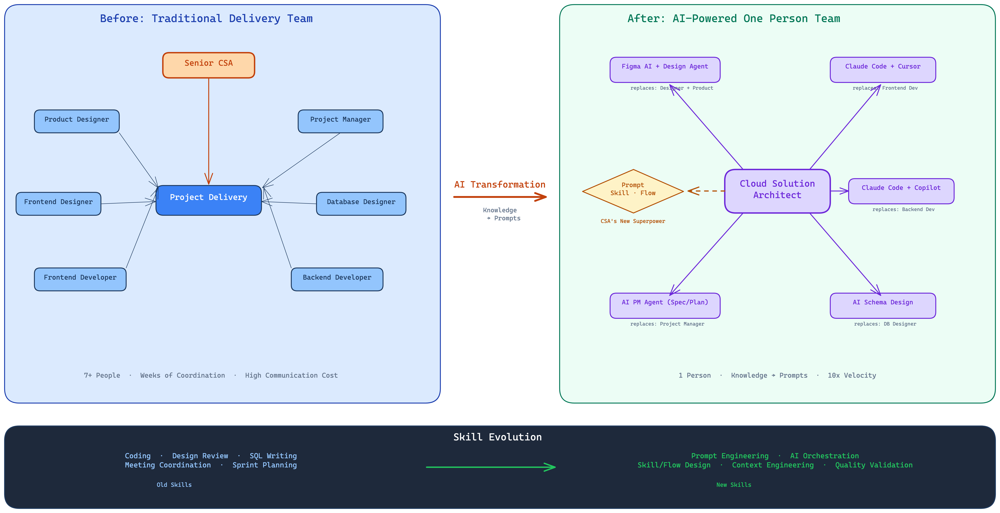
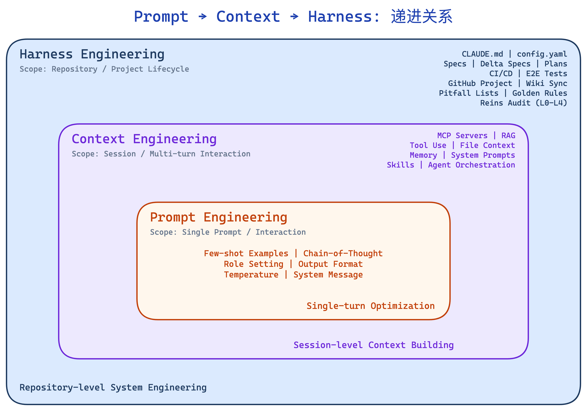
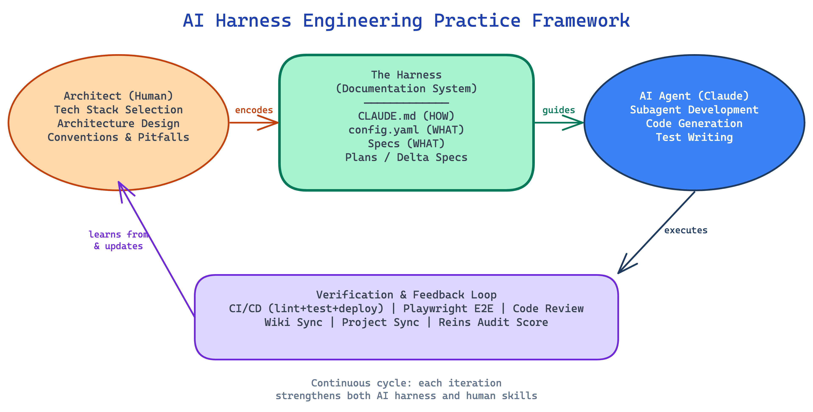
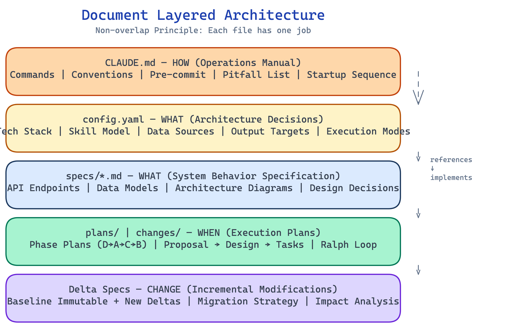

# 架构师视角的 AI Harness Engineering 最佳实践

> 从 ragflow-skill-orchestrator-studio 到 yoga-guru-copilot-platform 的实战经验

---

## 一、什么是 Harness Engineering

2026 年 2 月，OpenAI 工程师 Ryan Lopopolo 发表了 [Harness Engineering](https://openai.com/index/harness-engineering/) 一文，正式提出了这个概念：**人类驾驭（steer），AI 执行（execute）**。

"Harness" 一词来源于马具——人类不需要自己跑，而是通过缰绳（harness）控制马的方向和速度。在 AI 编程的语境中，Harness Engineering 是指：**将人类的工程智慧、架构决策和品质标准编码为机器可读的规则和约束，使 AI agent 能够在这些"缰绳"的引导下自主执行高质量的开发工作。**

OpenAI 提出了 Harness Engineering 的五大支柱：

1. **仓库即系统记录（Repository as System of Record）** — 所有知识版本化存储在仓库中
2. **分层领域架构（Layered Domain Architecture）** — 严格的层级排序和单向依赖
3. **Agent 可读性（Agent Legibility）** — 为 agent 理解而优化，不仅仅为人类
4. **黄金准则（Golden Principles）** — 将人类的"品味"机械化编码，在 CI 中强制执行
5. **垃圾回收（Garbage Collection）** — 后台 agent 持续清理技术债务和文档漂移

### 架构师的角色蜕变：从 Team 到 One Person Team

Harness Engineering 之所以对架构师至关重要，背后有一个更大的趋势：**AI 正在重新定义 Cloud Solution Architect（CSA）的角色边界**。

在传统交付模式中，一个中等规模的项目通常需要 7 个以上角色协同工作——Senior CSA、产品设计师、前端设计、前端开发、后端开发、数据库设计、项目经理——沟通成本高，协调周期长。而在 AI 工具链成熟的今天，一个掌握了 AI 编排能力的架构师，可以借助 Figma AI + Design Agent、Claude Code + Cursor/Copilot、AI Schema Design、AI PM Agent 等工具，将自己的领域知识转化为 Prompt、Skill 和 Flow，独立完成之前需要整个团队协作的工作。



这种转变不仅是工具的升级，更是**核心技能的根本重塑**：

| 传统技能 | AI 时代新技能 |
|---------|-------------|
| 手动编码（Coding） | Prompt Engineering — 将需求精确表达为 AI 可执行的指令 |
| 设计评审（Design Review） | AI Orchestration — 编排多个 AI Agent 协同完成设计与开发 |
| SQL 编写（SQL Writing） | Skill/Flow Design — 将重复工作流封装为可复用的 Skill 和 Flow |
| 会议协调（Meeting Coordination） | Context Engineering — 构建结构化上下文，让 AI 理解项目全貌 |
| Sprint 计划（Sprint Planning） | Quality Validation — 通过 CI/CD、E2E 测试和 Code Review 验证 AI 输出质量 |

架构师的核心价值从"亲自动手写代码"转变为"**驾驭 AI 的能力**"——即本文所讨论的 Harness Engineering。掌握好这套方法论，一个人就是一支团队（One Person Team）。

---

## 二、概念辨析：Prompt → Context → Harness

关于 Harness Engineering 的定义，社区有不同的视角。理解这三个概念的关系对于实践至关重要。



### 2.1 Prompt Engineering（提示工程）

最基础的层级。关注的是**单次交互中如何措辞**才能让 AI 给出更好的回答。典型实践包括：few-shot 示例、chain-of-thought、角色设定等。

- **作用域**：单次 prompt
- **生命周期**：一次对话
- **优化目标**：单个回答的质量

### 2.2 Context Engineering（上下文工程）

由 Anthropic 和社区推动的更广泛概念。关注的是**为 AI 构建丰富、结构化的上下文**，使其能理解项目全貌。典型实践包括：CLAUDE.md 文件、MCP Server、RAG、工具调用等。

- **作用域**：一次会话/任务
- **生命周期**：跨多次交互
- **优化目标**：AI 对项目的理解深度

### 2.3 Harness Engineering（驾驭工程）

最高层级的抽象。关注的是**仓库级别的系统工程**——将架构决策、编码规范、质量标准、工作流程全部编码为机器可读的规则，使 AI agent 能够在整个开发生命周期中自主工作。

- **作用域**：整个仓库/项目
- **生命周期**：项目全生命周期
- **优化目标**：AI 自主开发的质量、效率和可控性

### 2.4 三者的关系

有两种主流观点：

**观点一：包含关系** — Harness Engineering 是 Context Engineering 的超集，而 Context Engineering 是 Prompt Engineering 的超集。写好 prompt 是基础，构建好上下文是进阶，而把整个仓库工程化为 agent 可理解的系统是最高阶。

**观点二：正交关系** — Harness Engineering 更侧重于**仓库结构和工作流**的工程化，Context Engineering 更侧重于**运行时上下文**的构建。两者有交集但各有侧重。

**我的实践观点**：在实际项目中，这三者是**递进且互补**的。Prompt Engineering 的技巧被编码进了 CLAUDE.md 中的快捷命令映射；Context Engineering 的实践体现在文档分层和 Spec 驱动的上下文构建；Harness Engineering 则是将整个开发流程——从架构决策到 CI/CD 验证——编码为 AI 可执行的系统。

---

## 三、我的 Harness Engineering 实践框架

我在两个项目中系统性地实践了 Harness Engineering：

- **[ragflow-skill-orchestrator-studio](https://github.com/huqianghui/ragflow-skill-orchestrator-studio-vibe-coding)** — AI Agent 驱动的数据处理管道编排平台，使用 OpenSpec 管理规格
- **[yoga-guru-copilot-platform](https://github.com/huqianghui/yoga-guru-copilot-platform)** — 瑜伽教练 AI Copilot 平台，使用 Superpowers 管理开发流程



### 3.1 架构师先验知识编码

Harness Engineering 的核心价值在于：**将架构师的隐性知识显性化，编码为 AI agent 可执行的规则**。

#### 技术栈选型（config.yaml）

在项目启动前，架构师需要做出关键的技术决策。这些决策不能交给 AI，因为它们需要对业务需求、团队能力和生态系统有深入理解。我将这些决策固化在 `config.yaml` 中：

```yaml
# ragflow 项目的 config.yaml 示例
project:
  name: ragflow-skill-orchestrator-studio
  skill_model: Azure AI Skillset compatible
  custom_skill_types: [web_api, config_template, python_code]
  datasources: 16 types
  output_targets: [azure_ai_search, azure_blob, cosmosdb_gremlin, neo4j, mysql, postgresql]
  execution_modes: [sync, async]
```

对于 yoga-guru 项目，架构师的先验知识体现在 baseline spec 中的**代码复用策略**：明确标注从 ragflow 项目可复用约 60-70% 的代码（base.py, registry.py, session_proxy.py, 所有 CLI adapters, ORM models），需要改造的部分（context_builder, API），以及全新的模块（dispatcher, yoga-specific prompts/skills）。

#### 编码规范与陷阱清单（CLAUDE.md）

CLAUDE.md 不仅是操作手册，更是**架构师经验的编码**。两个项目的 CLAUDE.md 都包含了精心积累的"陷阱清单"：

**ragflow 的 13 条陷阱**（节选）：
- `ruff check` ≠ `ruff format` — 两个命令必须分别运行
- `httpx.Client` 必须用 `with` 上下文管理器，否则会泄漏 TCP 连接
- TypeScript 未使用的 import = CI 失败
- 静态路径必须在参数化路径之前注册（FastAPI 路由顺序）

**yoga-guru 的 10 条陷阱**（节选）：
- Pydantic datetime ≠ str — 序列化需要显式处理
- Vite WebSocket 代理需要 `ws: true` 配置
- Alembic async 环境需要特殊的 env.py 配置

这些陷阱不是泛泛的最佳实践，而是**在实际开发中踩过的坑**。将它们编码在 CLAUDE.md 中，意味着 AI agent 再也不会犯同样的错误——这就是 Harness Engineering 的价值。

#### 资源生命周期规则

两个项目都强制执行 `with` 上下文管理器用于 HTTP 客户端、数据库会话和文件句柄。这条规则看似简单，却是架构师对**生产可靠性**的深刻理解——一个未关闭的数据库连接可能在负载测试时才会暴露问题。

### 3.2 文档索引化分层



传统开发中，文档往往是非结构化的。Harness Engineering 要求**文档也必须索引化、分层化**，每个文件有明确的分工：

| 文档层级 | 文件 | 职责 | 类比 |
|---------|------|------|------|
| **操作层** | `CLAUDE.md` | HOW — 怎么做（命令、规范、陷阱） | 员工手册 |
| **配置层** | `config.yaml` | WHAT — 做什么（技术栈、架构决策） | 项目章程 |
| **规格层** | `specs/*.md` | WHAT — 系统行为规格（API、数据模型） | 建筑蓝图 |
| **计划层** | `plans/*.md` / `changes/` | WHEN — 执行计划（任务、依赖、验证） | 施工计划 |
| **变更层** | Delta Specs | CHANGE — 增量变更（基线不变，新增 delta） | 变更单 |

**关键原则：非重叠（Non-overlap）** — CLAUDE.md 只写 HOW，不写 WHAT；Spec 只写 WHAT，不写 HOW。这种分离确保了信息的单一来源（single source of truth），避免了不同文件之间的矛盾。

### 3.3 Spec 驱动开发

两个项目使用了不同的 Spec 管理工具，提供了有价值的对比视角。

#### 方案一：OpenSpec（ragflow 项目）

[OpenSpec](https://github.com/obra/openspec) 提供了完整的规格生命周期管理：

```
openspec/
├── config.yaml          # 项目元数据 + 22 个 spec 文件索引
├── specs/               # 22 个模块规格（活文档）
│   ├── agents/spec.md
│   ├── pipelines/spec.md
│   └── ...
└── changes/             # 37 个归档变更
    ├── 2026-03-05-project-infrastructure/
    │   ├── .openspec.yaml
    │   ├── proposal.md   # WHY — 为什么要变更
    │   ├── design.md     # HOW — 技术设计
    │   └── tasks.md      # WHAT — 任务清单 [x]
    └── ...
```

**工作流**：`/opsx:propose` → `/opsx:apply` → `/opsx:archive`

每个变更都经历三步：提案（proposal）→ 设计（design）→ 执行（tasks）。37 个归档变更在 7 天内完成，平均每天约 5 个变更。

#### 方案二：Superpowers（yoga-guru 项目）

[Superpowers](https://github.com/obra/superpowers) 提供了更灵活的技能驱动开发：

```
docs/superpowers/
├── specs/
│   ├── 2026-03-14-yoga-guru-copilot-platform-design.md  # 基线规格
│   └── 2026-03-15-system-agents-and-skills.md           # Delta Spec
└── plans/
    ├── 2026-03-14-phase-d-infrastructure.md
    ├── 2026-03-14-phase-a-course-planning.md
    ├── 2026-03-14-phase-c-questionnaire.md
    └── 2026-03-14-phase-b-video-photo.md
```

**两阶段工作流**：
- **Pre-v1.0**：Phase plans（D → A → C → B）按依赖链执行
- **Post-v1.0**：Delta Spec + Issue 驱动，新功能通过 `/delta-spec` → `/plan` → `/dev` 完成

**CLAUDE.md 中的快捷命令映射**（中文 → skill）：

| 中文指令 | Superpowers Skill |
|---------|-------------------|
| "start dev" / "执行计划" | `superpowers:subagent-driven-development` |
| "brainstorm" / "设计功能" | `superpowers:brainstorming` |
| "写计划" | `superpowers:writing-plans` |
| "debug" | `superpowers:systematic-debugging` |
| "code review" | `superpowers:requesting-code-review` |
| "parallel exec" | `superpowers:dispatching-parallel-agents` |

#### 方案对比

| 维度 | OpenSpec | Superpowers |
|------|---------|-------------|
| 核心理念 | 规格即代码，变更可追溯 | 技能驱动，灵活编排 |
| 变更管理 | proposal → design → tasks 三步流程 | Delta Spec + Phase Plans |
| 基线策略 | Spec 是活文档，持续更新 | 基线不可变，只增 delta |
| 适合场景 | 高频迭代、需要完整审计轨迹 | 快速原型、技能复用 |
| 学习曲线 | 中等 | 低（自然语言命令） |
| 开发速度 | 7 天 37 个变更 | 2 天 40 个 commit |

### 3.4 Delta Spec 增量修改

Delta Spec 是 Harness Engineering 中的重要模式——**基线规格保持稳定，所有变更通过增量文件记录**。

**ragflow 的 Delta（OpenSpec changes）** 结构：
```
2026-03-10-workflow-flow-editor/
├── .openspec.yaml       # 元数据
├── proposal.md          # 问题描述、影响分析、成功标准
├── design.md            # 技术设计、文件结构、代码模式
├── tasks.md             # 9 个任务组、34 个子任务 [x]
└── specs/               # 受影响的 spec 片段更新
```

**yoga-guru 的 Delta Spec** 特点：
- 必须包含：基线引用、变更内容、未变部分、迁移策略
- 基线 spec 永不修改，只添加新的 delta 文件
- 例：`2026-03-15-system-agents-and-skills.md` 扩展了 agent 模块的 Skills CRUD 和 agent-skill 关联功能

### 3.5 自动化同步与质量保障

Harness Engineering 不仅是文档，更是**自动化执行的工程系统**。

#### CI/CD Pipeline

两个项目都实现了完整的 CI/CD：

```
backend-test (ruff lint + format + pytest)
    → frontend-test (tsc + build)
        → e2e-test (Playwright + Chromium)  # yoga-guru 在 CI 中运行
            → deploy (Docker → ACR → Azure Container Apps)
```

#### Playwright E2E 测试

- **ragflow**：11 个 E2E spec 覆盖 agent playground、pipeline CRUD、workflow editor 等
- **yoga-guru**：8 个 E2E spec 覆盖认证、dashboard、各 Copilot 功能

Playwright 测试不仅验证功能正确性，还是 AI agent 开发的**反馈回路**——测试失败时，agent 可以自动定位问题并修复。

#### GitHub Wiki 自动同步

```yaml
# sync-wiki.yml — 代码变更时自动更新 Wiki
on:
  push:
    paths: [wiki/**, openspec/**, CLAUDE.md, 'backend/**', 'frontend/**']
```

`generate-wiki-pages.sh` 脚本自动统计：API 模块数、ORM 模型数、测试文件数、页面数、E2E spec 数，更新到 Wiki 首页。**代码和文档始终同步**。

#### GitHub Project 任务追踪

```yaml
# sync-project.yml — 从 spec/plan 文件自动创建 Project 条目
# ragflow: 解析 openspec/changes/ 目录，状态机同步
#   active change → Todo/In Progress（检查 tasks.md 的 [x]）
#   archived change → Done
# yoga-guru: 解析 plans/ 中的 "### Task N:" 标题
```

- **ragflow Project #6**：38 个条目，从 OpenSpec changes 自动同步
- **yoga-guru Project #7**：36 个条目，从 Phase plans 自动同步

### 3.6 Ralph Loop 串行执行

Ralph Loop 是一种多任务串行执行模式，适用于有依赖关系的任务链。

yoga-guru 的 `.ralph-progress.md` 追踪文件：
```
Phase D (Infrastructure): 7 tasks [all ✓]
Phase A (Course Planning): 7 tasks [all ✓]
Phase C (Questionnaire):   5 tasks [all ✓]
Phase B (Video/Photo):     8 tasks [all ✓]
```

执行顺序遵循依赖链：D（基础设施）→ A（核心功能）→ C（问卷）→ B（视频/照片）。Ralph Loop 确保 agent 不会跳过前置任务，同时通过进度文件在不同 agent 会话间保持状态。

---

## 四、工具链全景对比

| 维度 | OpenSpec | Superpowers | BMAD | Reins |
|------|---------|-------------|------|-------|
| **定位** | Spec 生命周期管理 | 技能驱动开发编排 | 全栈 Agent 开发方法论 | 仓库就绪度评估工具 |
| **核心能力** | propose → apply → archive | brainstorm → plan → dev → review | PM → Architect → Dev → QA 角色链 | init → audit → evolve → doctor |
| **Spec 管理** | 活文档 + 变更归档 | 基线不变 + delta | Story → PRD → Architecture → Tasks | 评分 + 建议 |
| **开发适用** | TypeScript/Python 全栈 | Claude Code 生态 | 多框架支持 | 框架无关 |
| **成熟度模型** | 无 | 无 | 无 | L0-L4 五级成熟度 |
| **CI 集成** | 自定义 sync workflows | skill 调用 | 角色验证 | `reins audit` 在 CI 中运行 |
| **适合团队** | 需要审计轨迹的团队 | 追求开发速度的团队 | 角色分工明确的团队 | 评估和改进 agent 就绪度 |

### Reins 的五级成熟度模型

[Reins CLI](https://github.com/WellDunDun/reins) 工具提供了量化的成熟度评估（0-24 分，6 个维度）：

| 等级 | 分数 | 含义 |
|------|------|------|
| L0: Manual | 0-6 | 传统工程，无 agent 基础设施 |
| L1: Inloop | 7-12 | Agent 辅助，人类仍写代码 |
| L2: Guided Outloop | 13-18 | 人类驾驭，agent 执行大部分代码 |
| L3: Full Outloop | 19-21 | Agent 处理完整生命周期 |
| L4: Zero Touch | 22-24 | 系统自我维护和改进 |

**我的两个项目评估**：基于 Reins 的六维度评估，ragflow 和 yoga-guru 大约处于 **L2-L3**（Guided Outloop 到 Full Outloop）——具备完整的仓库知识、架构文档、agent 工作流，但垃圾回收（自动技术债务清理）还不够完善。

---

## 五、AI 的三重角色 — 工具、老师、同事

论文 [How AI Impacts Skill Formation](https://arxiv.org/abs/2601.20245)（Judy Hanwen Shen, Alex Tamkin, 2026）的实验发现，为 Harness Engineering 的实践提供了重要的理论指导。

### 5.1 关键发现

研究者让 52 名软件开发者学习一个新的异步 Python 库（Trio），其中 26 人可使用 AI 辅助（GPT-4o chat），26 人不使用。结果：

| 指标 | AI 组 | 非 AI 组 | 差异 |
|------|-------|---------|------|
| 知识测验分数 | 显著更低 | 显著更高 | Cohen's d=0.738, p=0.01 |
| 任务完成速度 | 无显著差异 | — | AI 交互时间抵消了编码加速 |
| 调试能力 | 差距最大 | 独立解决更多 bug | AI 组中位数仅 1 个错误/任务 vs 3 个 |

**核心结论**：AI 辅助在不显著提升效率的同时，显著降低了技能形成——尤其是调试能力。

### 5.2 六种 AI 交互模式

研究识别出六种典型的 AI 交互模式：

**低分组（测验 < 40%）— 学习效果差：**

| 模式 | 特征 | 问题 |
|------|------|------|
| **AI 委托型** | 完全依赖 AI 写代码 | 最快完成但最差学习 |
| **渐进依赖型** | 先独立尝试，后全部委托 | 未掌握后续概念 |
| **迭代调试型** | 反复让 AI 修 bug，不理解原因 | 慢且学习差 |

**高分组（测验 ≥ 65%）— 学习效果好：**

| 模式 | 特征 | 优势 |
|------|------|------|
| **先生成后理解型** | 让 AI 生成代码后追问理解 | 主动消化 |
| **混合代码解释型** | 同时要求代码和解释 | 认知参与高 |
| **概念查询型** | 只问概念，自己写代码和调试 | 最高学习效果 |

### 5.3 设计原则：保持认知参与

论文的启示可以直接指导 Harness Engineering 的实践设计：

**AI 作为工具（Tool）— 执行层**：让 AI agent 处理机械性的编码工作（脚手架生成、CRUD 代码、测试用例），人类不需要在这些地方"学习"。

**AI 作为老师（Teacher）— 理解层**：当遇到新技术或复杂架构决策时，使用"概念查询"模式——问 AI 解释原理、权衡利弊，但**自己做最终决策**。在 CLAUDE.md 中记录决策理由，这个记录过程本身就是学习。

**AI 作为同事（Colleague）— 协作层**：通过 Code Review（`superpowers:requesting-code-review`）和 Debug（`superpowers:systematic-debugging`）skill，让 AI 提供另一个视角，但人类始终参与分析过程。

### 5.4 在 Harness Engineering 中编码学习保障

基于论文发现，我在实践中设计了以下机制：

1. **架构决策必须人类做** — config.yaml 和 baseline spec 由架构师编写，AI 不能自动生成架构方案
2. **陷阱清单由人类积累** — CLAUDE.md 的 pitfall list 不是让 AI 生成的，而是开发过程中遇到真实问题后人类总结的
3. **Delta Spec 需要人类审批** — AI 可以提议变更（proposal），但设计决策（design）需要人类确认
4. **Code Review 是双向的** — 不仅 AI review 人类的代码，人类也要 review AI 的输出
5. **定期同步代码和文档** — 人类通过阅读同步后的 Wiki 和 Changelog，保持对项目全貌的理解

这样设计的核心逻辑是：**Harness Engineering 的目标不仅是提升 AI 的执行效率，更要确保"驾驭者"（人类）的驾驭能力持续成长**。否则，随着技能退化，人类将失去有效驾驭 AI 的能力——这就是论文所警示的"辅助困境"（Assistance Dilemma）。

---

## 六、最佳实践清单

### 项目启动阶段
- [ ] 架构师完成技术栈选型，固化到 `config.yaml`
- [ ] 编写 baseline spec（系统行为规格）
- [ ] 配置 CLAUDE.md（操作手册、编码规范、预提交检查）
- [ ] 选择 Spec 管理工具（OpenSpec / Superpowers）
- [ ] 配置 CI/CD pipeline
- [ ] 初始化 GitHub Project

### 开发迭代阶段
- [ ] 新功能通过 Delta Spec / Change Proposal 发起
- [ ] AI 执行编码，人类审查架构决策
- [ ] 每个 change 包含自动化测试验证
- [ ] tasks.md 逐项勾选，进度可追溯

### 质量保障阶段
- [ ] Playwright E2E 测试覆盖关键路径
- [ ] CI 强制执行 lint + format + type-check + test
- [ ] Code Review（AI + 人类双向）
- [ ] 定期同步代码统计到 Wiki

### 知识管理阶段
- [ ] 新发现的陷阱及时添加到 CLAUDE.md pitfall list
- [ ] 架构决策记录在 spec 的设计决策部分
- [ ] 变更完成后归档（OpenSpec archive / delta spec 文件）
- [ ] 定期评估 Reins 成熟度分数，识别改进方向

### 技能成长保障
- [ ] 架构决策和新技术学习不委托给 AI
- [ ] 使用"概念查询"模式而非"AI 委托"模式学习新东西
- [ ] 定期 review AI 生成的代码，保持代码阅读能力
- [ ] 遇到 bug 先自己分析再用 AI 辅助调试

---

## 七、总结

AI Harness Engineering 不是简单的"让 AI 写代码"，而是一种**系统工程方法论**——将架构师的智慧编码为机器可读的规则，使 AI agent 能够在这些规则的约束下自主执行高质量的开发工作。

从我在两个项目中的实践来看，关键成功因素包括：

1. **架构师先验知识是不可替代的** — 技术栈选型、编码规范、陷阱清单都需要人类的深度思考
2. **文档必须索引化分层** — CLAUDE.md (HOW) + Spec (WHAT) + Plan (WHEN) + Delta (CHANGE) 各司其职
3. **Spec 驱动的开发流程** — 无论是 OpenSpec 还是 Superpowers，核心都是"先规格、后编码"
4. **自动化是基石** — CI/CD、Wiki 同步、Project 追踪，让 agent 和人类都能看到一致的项目状态
5. **学习保障同样重要** — 在享受 AI 提效的同时，通过"概念查询"模式和决策参与，保持自身能力的持续成长

**最终目标**：人类作为架构师和驾驭者，用更少的时间完成更多、更高质量的工作，同时自身的工程能力也在这个过程中持续进化。这就是 AI Harness Engineering 的愿景——**不是被 AI 取代，而是与 AI 共同进化**。

---

#### 相关笔记

- [[AI-Native开发实践：从Figma设计到Superpowers Brainstorm再到Spec-Delta工作流]]
- [[Claude Code的Agent与Subagent架构解析——以Superpowers为例]]
- [[Claude Code扩展三剑客：Command、Skill与Agent的区别与协作]]
- [[在Obsidian中用Excalidraw与Draw.io绘制Azure架构图实战指南]]

#### 参考链接

- OpenAI Harness Engineering: [openai.com](https://openai.com/index/harness-engineering/)
- Harness Engineering 深度解读: [madplay.github.io](https://madplay.github.io/en/post/harness-engineering)
- Skill Issue — Harness Engineering for Coding Agents: [humanlayer.dev](https://www.humanlayer.dev/blog/skill-issue-harness-engineering-for-coding-agents)
- Reins CLI: [GitHub](https://github.com/WellDunDun/reins/tree/master/cli/reins)
- How AI Impacts Skill Formation: [arXiv:2601.20245](https://arxiv.org/abs/2601.20245)
- OpenSpec: [GitHub](https://github.com/obra/openspec)
- Superpowers: [GitHub](https://github.com/obra/superpowers)
