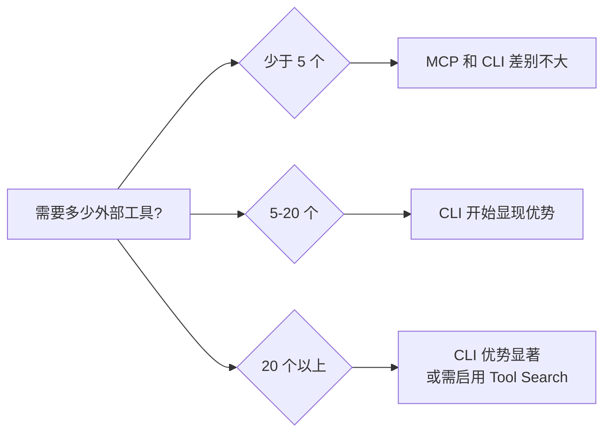
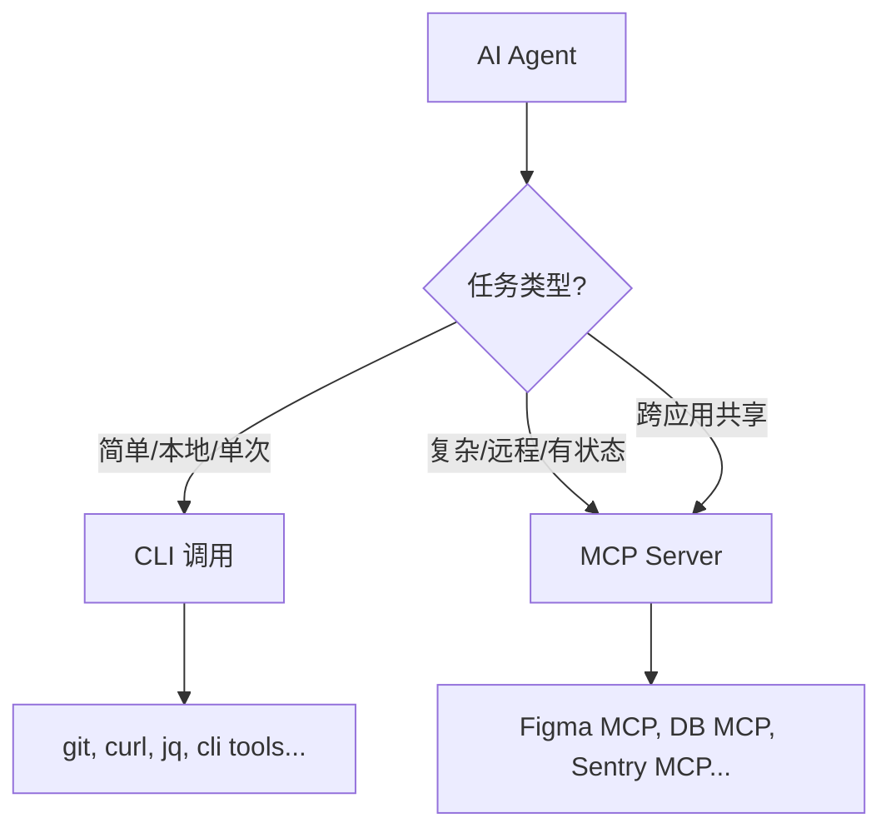

# MCP vs CLI — 为什么开发者在重新审视 MCP

> [!abstract] 摘要
> 随着 AI 编码工具的快速演进，社区中出现了一股"放弃 MCP，回归 CLI"的声音。本文梳理 MCP 和 CLI 两种范式的核心差异、各自优劣，以及为什么一些开发者正在重新评估 MCP 的价值。

---

## 1. 什么是 MCP？什么是 CLI 工具？

### MCP（Model Context Protocol）

MCP 是 Anthropic 于 2024 年底推出的==开源协议标准==，用于将 AI 应用连接到外部系统。可以把它理解为"AI 应用的 USB-C 接口"——提供统一方式让 AI 访问数据源、工具和工作流。

**架构核心：**
- **MCP Host**：AI 应用（如 Claude Desktop、VS Code）
- **MCP Client**：Host 中维护与 Server 连接的组件
- **MCP Server**：提供上下文数据的程序（本地或远程）

**三大原语（Primitives）：**
- **Tools**：可执行的函数（文件操作、API 调用、数据库查询）
- **Resources**：数据源（文件内容、数据库记录）
- **Prompts**：可复用的交互模板

**传输层：**
- STDIO 传输：本地进程间通信，零网络开销
- Streamable HTTP 传输：远程服务器通信，支持 OAuth 认证

### CLI 工具方式

CLI（Command Line Interface）方式是指 AI agent 直接通过调用==命令行工具==来完成任务。例如 Claude Code 可以直接运行 `git`、`npm`、`curl`、`obsidian-cli` 等命令。

**核心特点：**
- AI 通过 Bash/Shell 直接执行命令
- 利用现有的 Unix/Linux 工具生态
- 无需额外协议层，直接调用已安装的 CLI 工具
- 输入输出都是纯文本流

---

## 2. 核心对比

| 维度 | MCP | CLI |
|------|-----|-----|
| **架构** | Client-Server 协议，JSON-RPC 2.0 | 直接进程调用，stdin/stdout |
| **复杂度** | 需要运行 MCP Server 进程 | 直接调用已有命令行工具 |
| **发现机制** | 动态工具发现（`tools/list`） | 静态，工具需预先配置或安装 |
| **类型安全** | JSON Schema 定义输入输出 | 纯文本，需自行解析 |
| **生态** | 专用 MCP Server 生态（仍在建设中） | 成熟的 Unix 工具链 |
| **调试** | 需要专门工具（MCP Inspector） | 标准调试方式（日志、管道） |
| **安全** | 需信任第三方 MCP Server | 受限于系统权限模型 |
| **状态管理** | 有状态协议，支持通知和动态更新 | 无状态，每次调用独立 |
| **部署** | 需额外配置和启动 Server | 安装 CLI 即可 |
| **通用性** | 跨 AI 应用（Claude, ChatGPT, VS Code...） | 依赖具体 AI agent 的 Bash 能力 |

---

## 3. 深度解析：模型如何"知道"可以调用什么？

> [!important] 本章核心问题
> MCP 通过 `tools/list` 把所有工具定义塞进上下文；CLI 方式下模型又是怎么知道该用什么命令的？两者在上下文消耗、调用效率上有何本质差异？

### 3.1 MCP 的工作流程：显式注册，全量注入

MCP 的工作原理可以用一句话概括：**每个 MCP Server 把自己所有工具的完整定义，通过 `tools/list` 注册到上下文中，模型每次推理时都能"看到"所有工具。**

```
┌─────────────────────────────────────────────────────────┐
│                   模型的上下文窗口                         │
│                                                         │
│  ┌─────────────────────────────────────────────────┐    │
│  │ System Prompt（系统提示词）                        │    │
│  └─────────────────────────────────────────────────┘    │
│  ┌─────────────────────────────────────────────────┐    │
│  │ MCP Tool 定义区（占用大量 token）                   │    │
│  │                                                 │    │
│  │  ├─ Figma Server: 12 个工具定义                  │    │
│  │  │   ├─ get_design_context (name+desc+schema)   │    │
│  │  │   ├─ get_screenshot (name+desc+schema)       │    │
│  │  │   ├─ get_metadata (name+desc+schema)         │    │
│  │  │   └─ ... 每个都有完整 JSON Schema             │    │
│  │  ├─ Playwright Server: 20+ 工具定义              │    │
│  │  ├─ Pencil Server: 15+ 工具定义                  │    │
│  │  ├─ Chrome DevTools: 25+ 工具定义                │    │
│  │  └─ ...更多 MCP Server...                       │    │
│  └─────────────────────────────────────────────────┘    │
│  ┌─────────────────────────────────────────────────┐    │
│  │ 内置工具定义（Bash, Read, Write, Edit 等 ~10个）   │    │
│  └─────────────────────────────────────────────────┘    │
│  ┌─────────────────────────────────────────────────┐    │
│  │ 对话历史 + 用户消息（实际可用空间被压缩）           │    │
│  └─────────────────────────────────────────────────┘    │
└─────────────────────────────────────────────────────────┘
```

**具体流程：**

1. Claude Code 启动时，连接所有已配置的 MCP Server
2. 对每个 Server 调用 `tools/list`，获取该 Server 暴露的所有工具
3. 每个工具的定义包括：`name`、`description`、`inputSchema`（完整 JSON Schema）
4. ==所有这些定义在每次 API 调用时都会作为 `tools` 参数发送给模型==
5. 模型根据这些定义决定调用哪个工具、传什么参数

**举例说明——一个 Figma 工具定义大约消耗多少 token：**

```json
{
  "name": "mcp__plugin_figma_figma__get_design_context",
  "description": "Get design context for a Figma node — the primary tool
    for design-to-code workflows. Returns reference code, a screenshot,
    and contextual metadata that should be adapted to the target project...",
  "inputSchema": {
    "type": "object",
    "properties": {
      "nodeId": { "type": "string", "pattern": "...", "description": "..." },
      "fileKey": { "type": "string", "description": "..." },
      "clientLanguages": { "type": "string", "description": "..." },
      "clientFrameworks": { "type": "string", "description": "..." },
      "excludeScreenshot": { "type": "boolean", "description": "..." },
      "forceCode": { "type": "boolean", "description": "..." },
      "disableCodeConnect": { "type": "boolean", "description": "..." }
    },
    "required": ["nodeId", "fileKey"]
  }
}
```

> [!warning] 上下文膨胀问题
> 单个工具定义约 200-500 tokens。当前会话加载了 Figma（14个工具）+ Pencil（12个）+ Chrome DevTools（25个）+ Playwright（18个）= ==约 70 个 MCP 工具，消耗约 15,000-25,000 tokens==，仅工具定义就可能占据上下文窗口的 10% 以上。

### 3.2 CLI 的工作流程：一个 Bash 工具 + 模型内置知识

CLI 方式的核心思路完全不同：**只需要定义一个 `Bash` 工具，模型靠自身训练获得的知识来知道该执行什么命令。**

```
┌─────────────────────────────────────────────────────────┐
│                   模型的上下文窗口                         │
│                                                         │
│  ┌─────────────────────────────────────────────────┐    │
│  │ System Prompt + 行为指南                          │    │
│  │ "用 Read 而非 cat，用 Grep 而非 grep..."          │    │
│  └─────────────────────────────────────────────────┘    │
│  ┌─────────────────────────────────────────────────┐    │
│  │ 内置工具定义（仅约 10 个，固定不变）                │    │
│  │  ├─ Bash（可执行任意命令的万能入口）               │    │
│  │  ├─ Read / Write / Edit                         │    │
│  │  ├─ Grep / Glob                                 │    │
│  │  ├─ Agent / WebFetch / WebSearch                │    │
│  │  └─ ... 共约 10 个                               │    │
│  └─────────────────────────────────────────────────┘    │
│  ┌─────────────────────────────────────────────────┐    │
│  │ 对话历史 + 用户消息（大量可用空间）                 │    │
│  └─────────────────────────────────────────────────┘    │
└─────────────────────────────────────────────────────────┘

   +  模型权重中内置的知识（不占上下文）：
      ├─ git 的所有子命令和参数
      ├─ npm / yarn / pnpm 的用法
      ├─ curl / wget 的参数
      ├─ jq / sed / awk 语法
      ├─ obsidian-cli 的命令（如果训练数据中有）
      └─ 数千种 CLI 工具的知识...
```

**具体流程：**

1. Claude Code 只向模型注册约 ==10 个内置工具==（Bash, Read, Write, Edit, Grep, Glob 等）
2. 这些工具定义是固定的，每次完全相同，总共约 ==2,000-3,000 tokens==
3. 当需要执行 CLI 操作时，模型调用 `Bash` 工具，自行构造命令
4. ==模型靠训练数据中学到的知识==来知道 `git log --oneline` 该怎么写、`curl -X POST` 需要什么参数
5. 命令执行后，stdout/stderr 文本返回给模型

**关键洞察：CLI 知识存储在模型权重中，不占上下文窗口。**

### 3.3 厘清概念：内置工具 ≠ CLI 工具 ≠ MCP 工具

> [!question] 常见疑问 1
> 前面说内置工具有 ~10 个、消耗 ~2,000-3,000 tokens，又说 CLI 方式"不占上下文"——这不矛盾吗？

> [!question] 常见疑问 2
> Read 不就是 `cat`？Edit 不就是 `sed`？模型明明已经知道这些命令了，为什么还要花 2-3K tokens 再定义一遍？

#### 先回答第一个问题：三层结构，不要混为一谈

```
┌─────────────────────────────────────────────────────────────┐
│  第 1 层：内置工具（Built-in Tools）                          │
│  ┌───────────────────────────────────────────────────────┐  │
│  │ Bash, Read, Write, Edit, Grep, Glob, Agent...        │  │
│  │ 数量：固定 ~10 个 | 上下文消耗：~2-3K tokens（固定）    │  │
│  │ 性质：Claude Code 框架自身的工具定义                    │  │
│  └───────────┬───────────────────────────────────────────┘  │
│              │                                               │
│              ▼ 通过 Bash 工具访问                             │
│  ┌───────────────────────────────────────────────────────┐  │
│  │ 第 2 层：CLI 工具（通过 Bash 间接调用）                  │  │
│  │ git, npm, curl, jq, obsidian-cli, ffmpeg, docker...   │  │
│  │ 数量：无限 | 上下文消耗：0 tokens（靠模型权重知识）      │  │
│  │ 性质：操作系统上已安装的命令行程序                       │  │
│  └───────────────────────────────────────────────────────┘  │
│                                                              │
│  ┌───────────────────────────────────────────────────────┐  │
│  │ 第 3 层：MCP 工具（通过 MCP Server 注册）               │  │
│  │ figma__get_design_context, playwright__click...        │  │
│  │ 数量：随 Server 增长 | 上下文消耗：N × 200-500 tokens  │  │
│  │ 性质：第三方 MCP Server 暴露的工具定义                  │  │
│  └───────────────────────────────────────────────────────┘  │
└─────────────────────────────────────────────────────────────┘
```

**关键区别：**

| | 内置工具 | CLI 工具 | MCP 工具 |
|--|---------|---------|---------|
| **例子** | Bash, Read, Edit | git, curl, jq | figma__get_screenshot |
| **数量** | ==固定 ~10 个== | 无限 | ==随 Server 线性增长== |
| **token 消耗** | ~2-3K（不变） | 0 | N × 200-500 |
| **怎么知道用法** | 工具定义（上下文） | 模型训练知识（权重） | 工具定义（上下文） |

> [!tip] 一句话总结
> 内置工具是==固定税==（~2-3K tokens，无论如何都要交，但不会涨）；CLI 工具是==免费的无限扩展==（通过 Bash 入口）；MCP 工具是==累进税==（每多一个就多交一份 token）。

#### 再回答第二个问题：Read ≈ cat、Edit ≈ sed，为什么不直接用 Bash？

你说得对——==功能上==，Read 就是 `cat`，Edit 就是 `sed`，Grep 就是 `rg`。模型当然知道这些命令怎么用。单独做成内置工具，**不是因为模型不会用 Bash 命令**，而是为了 Claude Code 框架的==权限控制和用户体验==：

| 内置工具 | 等价 Bash 命令 | 为什么要单独做？ |
|---------|--------------|----------------|
| `Read` | `cat -n` | 用户界面清晰显示"正在读某文件"；支持 PDF/图片/notebook；可分页 |
| `Edit` | `sed` / `awk` | 用户界面==展示精确 diff==，可逐个审批每处修改 |
| `Write` | `echo > file` | 用户可审批"将要创建什么文件、什么内容" |
| `Grep` | `rg` / `grep` | 搜索文件 vs 执行任意命令是不同的风险等级 |
| `Glob` | `find` / `ls` | 同上，查找文件名是低风险操作 |

**核心原因是==权限分级==——将操作按风险拆分：**

```
风险等级低  ← Read, Grep, Glob     → 框架可自动批准，不打扰用户
风险等级中  ← Edit, Write          → 展示 diff / 预览内容，用户确认
风险等级高  ← Bash（可执行任意命令） → 需要用户逐条审批
```

如果所有操作都走 Bash，用户看到的全是 `Bash("cat file.txt")`、`Bash("sed -i ...")`——框架==无法区分风险等级==，只能要么全部放行（不安全），要么全部弹框（太烦）。

#### 那这 2-3K tokens 到底花在哪里了？

这些 token 并不是在"教模型 cat 怎么用"，而是花在了三件完全不同的事情上：

**1. 告知模型"当前环境可以调用哪些接口"（API 协议硬性要求）**

```
模型知道 "cat" 怎么用       ← 训练知识（存在权重中，免费）
模型不知道 "这次你可以调 Read" ← 必须通过 tools 参数告知（消耗 token）
```

这是 Claude API 的 tool use 机制决定的：即使模型"认识" cat，它也==不知道当前环境给它开放了一个叫 `Read` 的接口==，除非你在 `tools` 参数里告诉它。就像你认识一个同事，但你不知道他今天在不在会议室，得有人告诉你。

**2. 行为约束和偏好指引**

工具定义中嵌入了大量的行为约束，比如：

```
# Read 工具定义中的指引（占 token 的主力）
"IMPORTANT: Avoid using Bash to run cat, head, tail, sed...
 Instead, use the appropriate dedicated tool:
 - File search: Use Glob (NOT find or ls)
 - Content search: Use Grep (NOT grep or rg)
 - Read files: Use Read (NOT cat/head/tail)
 - Edit files: Use Edit (NOT sed/awk)"
```

这些约束消耗了大量 token，本质上是在说："你虽然会用 cat，但==在这个环境里不许用==，必须用我们定义的 Read。"

**3. 参数 Schema（最小的部分）**

```json
"input_schema": {
  "properties": {
    "file_path": {"type": "string", "description": "The absolute path..."},
    "offset": {"type": "number", "description": "The line number to start..."},
    "limit": {"type": "number", "description": "The number of lines..."}
  },
  "required": ["file_path"]
}
```

> [!abstract] 所以这 2-3K tokens 的本质是：
> - ==不是==在教模型"怎么读文件"（模型已经知道）
> - ==而是==在告诉模型"在这个框架里，你只能通过 Read/Edit/Bash 这些接口来操作，而且优先用 Read 不要用 cat"
> - 这是 **框架的控制成本**，不是模型的学习成本

#### CLI 模式下的"隐藏成本"

CLI 并非完全"免费"，它有两种隐藏成本：

1. **`--help` 探索成本**：当模型不认识某个 CLI 工具时，需要先调用 `tool --help`，这消耗的不是上下文 token，而是==额外的 API 调用轮次==（每次调用都有延迟和费用）

```
认识 git（常见工具）：
  用户请求 → 模型直接构造命令 → 1 次调用搞定

不认识 obsidian-cli（冷门工具）：
  用户请求 → 模型调用 obsidian-cli --help → 读取输出 → 再构造命令
  = 2 次调用，但第 2 次之后就"学会了"（在当前对话中）
```

2. **Skill/Plugin 注入成本**：Claude Code 的 Skill 系统会在触发时==向系统提示词注入指引==（比如本次对话中 obsidian-markdown skill 被激活后，其使用说明就注入了上下文）。这类似于"按需加载的小型 MCP"，但只在 skill 被触发时才出现，不是一直驻留。

### 3.4 全维度对比：上下文效率与调用模式

| 维度 | MCP | CLI (Bash) |
|------|-----|------------|
| **工具知识存储位置** | 上下文窗口（每次都发送） | 模型权重（训练时学会） |
| **单工具 token 消耗** | 200-500 tokens/工具 | 0（Bash 工具本身 ~300 tokens） |
| **10 个外部工具** | ~3,000-5,000 tokens | ~300 tokens（共用一个 Bash） |
| **50 个外部工具** | ~15,000-25,000 tokens | ~300 tokens |
| **100 个外部工具** | ==~30,000-50,000 tokens== | ~300 tokens |
| **工具数量对上下文的影响** | 线性增长，严重挤占空间 | 几乎为零 |
| **参数正确性保证** | JSON Schema 校验，高 | 依赖模型知识，中等 |
| **新工具/不常见工具** | 通过定义精确描述，模型能理解 | 模型可能不熟悉，需要帮助 |
| **完成同一任务的调用次数** | 通常 1 次（直接调用特定工具） | 可能 1-3 次（先探索再执行） |
| **返回值格式** | 结构化 JSON | 纯文本，需模型解析 |
| **错误处理** | 协议级错误码 | exit code + stderr 文本 |

### 3.5 调用流程对比：以"读取 Git 最近 5 条提交"为例

**MCP 方式（假设有 Git MCP Server）：**

```
用户: "看看最近的 Git 提交"

[模型在上下文中看到工具定义]
→ tools: [{name: "git_log", inputSchema: {count: number, format: string, ...}}]

[模型调用]
→ tool_call: git_log({count: 5, format: "oneline"})

[MCP 通信链路]
→ Claude Code → JSON-RPC request → MCP Client → MCP Server → 执行 git log
→ MCP Server → JSON-RPC response → MCP Client → Claude Code → 模型

结果: 结构化 JSON 返回
上下文消耗: 工具定义 ~300 tokens + 调用/响应 ~200 tokens
```

**CLI 方式（Claude Code 内置）：**

```
用户: "看看最近的 Git 提交"

[模型在上下文中看到]
→ tools: [{name: "Bash", inputSchema: {command: string}}]

[模型靠自身知识构造命令]
→ tool_call: Bash({command: "git log --oneline -5"})

[直接执行]
→ Claude Code → shell → git log --oneline -5 → stdout

结果: 纯文本返回
上下文消耗: Bash 工具定义（共用）+ 调用/响应 ~150 tokens
```

> [!tip] 效率差异的根源
> MCP 的核心代价是==每个工具都需要在上下文中"自我介绍"==，而 CLI 的 `git` 命令不需要——因为模型在训练时已经"认识" git 了。这就像：MCP 是每次开会都要所有人重新做一轮自我介绍，CLI 是大家都是老同事，直接开干。

### 3.6 MCP 的应对策略：Tool Search（工具搜索）

Anthropic 也意识到了 MCP 的上下文膨胀问题，在 Claude Code 中引入了 ==Tool Search== 机制：

- 当 MCP 工具定义超过上下文窗口 10% 时自动启用
- 不再预先加载所有 MCP 工具定义
- 改为按需搜索：模型先用搜索工具找到相关工具，再加载其定义
- 类似于"懒加载"——用到时才加载

```
传统 MCP:  启动 → 加载全部 70 个工具定义 → 每次推理都带着
Tool Search: 启动 → 只加载搜索工具 → 需要时搜索 → 加载特定工具
```

这缓解了问题但并未完全解决——搜索本身仍需额外的一次模型调用。

### 3.7 CLI 的代价：模型可能"不认识"某些工具

CLI 方式也不是完美的。它的局限在于：

1. **冷门工具**：如果某个 CLI 工具很小众（训练数据中很少），模型可能不知道正确的命令格式，会瞎猜或出错
2. **复杂参数**：某些 CLI 工具参数组合很复杂（如 `ffmpeg`），模型可能需要多次试错
3. **版本差异**：模型训练数据中的是旧版 CLI，实际系统上可能是新版，参数可能已变
4. **无法自动发现**：模型不知道系统上安装了哪些 CLI 工具，需要通过 `which` 或 `--help` 探索

> [!example] 实际案例
> 当 Claude Code 需要使用 `obsidian-cli` 时，如果模型训练数据中没见过这个工具，它会：
> 1. 先运行 `obsidian-cli --help` 查看帮助信息（额外 1 次调用）
> 2. 根据帮助信息理解命令格式
> 3. 再执行实际命令
>
> 而如果是 MCP 方式，`obsidian-cli` 的所有能力会作为工具定义一次性注入，模型直接就知道该怎么调用。
>
> **但代价是**：这些定义会在==每次对话轮次中都存在==，即使你整个对话根本不需要 Obsidian 功能。

### 3.8 总结：什么时候上下文效率重要？



> [!abstract] 关键结论
> - **工具数量少**（< 5 个 MCP Server）：MCP 的上下文开销可忽略，且有类型安全优势
> - **工具数量中等**（5-20 个）：MCP 开始明显挤占上下文，CLI 在效率上胜出
> - **工具数量多**（20+）：MCP 必须配合 Tool Search，否则上下文压力巨大；CLI 依然只用一个 Bash 工具
> - **核心权衡**：MCP 用==上下文空间==换取==调用精确度==；CLI 用==模型内置知识==换取==上下文节省==

---

## 4. 为什么有人在放弃 MCP？

> [!warning] 核心问题
> MCP 的批评主要集中在==过度工程化==、==安全隐患==和==生态不成熟==三个方面。

### 4.1 过度工程化（Over-Engineering）

很多开发者发现，MCP 为了实现"标准化"引入了大量复杂性，但对于许多场景来说，一个简单的 CLI 调用就能解决问题：

```
# MCP 方式：需要一个 MCP Server + 配置 + JSON-RPC 通信
MCP Server (filesystem) → tools/call → read_file → JSON Response

# CLI 方式：一行命令
cat file.txt
```

> [!quote] 开发者常见反馈
> "我为什么需要运行一个 Node.js 进程来读文件？`cat` 就可以了。"

### 4.2 安全与信任问题

MCP 的安全模型存在显著隐患：

- **工具名称欺骗（Tool Confusion）**：当模型面对大量 MCP tools 时，可能调用错误的工具
- **Prompt Injection 风险**：恶意 MCP Server 可在 tool description 中注入指令
- **数据泄露**：MCP Server 可以看到传给它的所有上下文信息
- **缺乏信任机制**：目前没有完善的 MCP Server 声誉/审核系统
- **第三方代码执行**：安装第三方 MCP Server 本质上是在你的机器上运行他人的代码

> [!danger] 安全警示
> Anthropic 自己也承认，确定哪些 MCP Server 是安全的"remains unresolved"（仍未解决）。

### 4.3 生态不成熟

根据 Latent Space 播客中 Anthropic 团队的讨论：

- **Resources 和 Prompts 原语使用率低**：很多客户端只实现了 Tools，其他原语支持不完整
- **客户端实现参差不齐**：不同 AI 应用对 MCP 的支持程度差异巨大
- **工具膨胀**：大量质量参差不齐的 MCP Server 涌现，模型难以正确选择

### 4.4 性能与稳定性

- MCP Server 需要持续运行，占用系统资源
- 连接管理（重连、超时、状态同步）增加了失败点
- 对于简单操作，JSON-RPC 的开销是不必要的

### 4.5 CLI 的"够用即可"哲学

Unix 哲学——"做一件事，做好它"——在 AI 工具调用场景中再次被验证：

- `git` 已经是最好的 Git 工具
- `curl` 已经是最好的 HTTP 客户端
- `jq` 已经是最好的 JSON 处理器
- 为什么要用一个 MCP Server 来包装它们？

---

## 5. MCP 仍然有价值的场景

> [!tip] MCP 并非一无是处
> 在某些场景下，MCP 确实比 CLI 更有优势。

### 5.1 跨应用互操作

MCP 的最大价值是==一次构建，多处集成==。一个 MCP Server 可以同时被 Claude Desktop、VS Code、Cursor、ChatGPT 等应用使用。CLI 方式则需要每个 AI agent 单独适配。

### 5.2 复杂的有状态交互

数据库连接、实时通知、会话管理等需要维持状态的场景，MCP 的有状态协议更合适。

### 5.3 远程服务集成

需要认证的远程 API（如 Sentry、GitHub、Slack）通过 MCP 的 Streamable HTTP 传输可以更优雅地处理认证流程。

### 5.4 类型安全与发现

MCP 的 JSON Schema 定义让 AI 模型能精确理解工具的输入输出格式，减少调用错误。

---

## 6. 我的实际案例：Obsidian 集成

> [!example] 一个有趣的对比
> 我正在使用的 Obsidian + Claude Code 集成，实际上是通过 ==Obsidian CLI== 实现的，而非 MCP。

当前的 Obsidian 集成架构：

```
Claude Code → Bash Tool → obsidian-cli 命令 → Obsidian Vault
```

而不是：

```
Claude Code → MCP Client → Obsidian MCP Server → Obsidian Vault
```

这说明了一个关键事实：**CLI 方式在很多场景下已经足够好**。Obsidian CLI 提供了创建笔记、搜索、管理任务等所有必要功能，Claude Code 的 Bash 工具可以直接调用它们。

但需要注意的是，Claude Code ==同时也支持 MCP==。当前会话中就加载了多个 MCP Server（如 Pencil、Figma、Playwright 等）。这说明两种方式是**互补**的，而非互斥的。

---

## 7. 趋势判断：不是替代，而是分层

> [!info] 核心观点
> 行业正在形成一个==分层共识==：简单场景用 CLI，复杂场景用 MCP。

### 新兴模式



### 实践建议

1. **默认使用 CLI**：对于文件操作、Git、包管理等本地任务，直接 CLI 是最高效的
2. **MCP 用于跨应用集成**：需要被多个 AI 应用共用的工具，用 MCP 包装有价值
3. **MCP 用于复杂服务**：需要认证、状态管理、实时通知的远程服务，MCP 更合适
4. **避免 MCP 过度包装**：不要为了用 MCP 而用 MCP，简单 CLI 能解决的就用 CLI
5. **关注安全**：无论用哪种方式，都要审查第三方工具/Server 的安全性

---

## 8. 未来展望

- **MCP 协议持续演进**：从有状态向无状态 HTTP 转变，降低部署复杂度
- **CLI 工具 AI 适配**：更多 CLI 工具会优化其输出格式，让 AI 更容易解析
- **混合模式成为主流**：Claude Code 已经展示了 CLI + MCP 共存的模式
- **安全标准建立**：MCP 的安全审核和信任机制将逐步完善
- **模型能力提升**：随着模型对工具调用理解的提升，Tool Confusion 问题会减少

---

## 参考资料

- [MCP 官方文档 - 介绍](https://modelcontextprotocol.io/introduction)
- [MCP 架构概览](https://modelcontextprotocol.io/docs/learn/architecture)
- [Claude Code CLI 参考](https://code.claude.com/docs/en/cli-usage)
- [Latent Space Podcast - MCP 讨论](https://www.latent.space/p/mcp)（Anthropic 团队访谈）
- [Claude Code MCP 配置文档](https://code.claude.com/docs/en/mcp)

---

*最后更新：2026-03-14*

## 相关文章

- [[OpenCLI——万物皆可CLI的结构化革命]] — CLI 作为 Agent 交互替代方案
- [[Agent-Reach与OpenCLI——命令编排型Agent框架的两条路线]] — 命令编排型框架路线
- [[Exa、Tavily与Context7——AI Agent搜索三剑客的定位与MCP配置实践]] — MCP 工具生态实践
