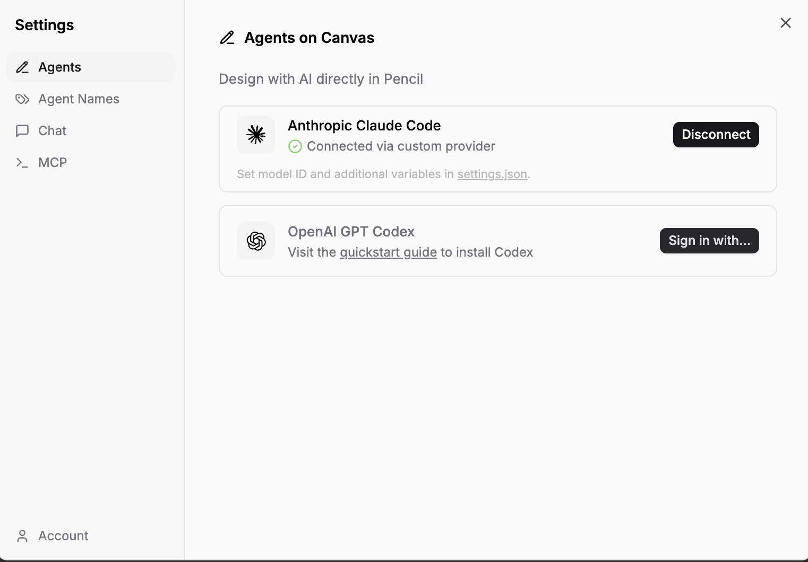
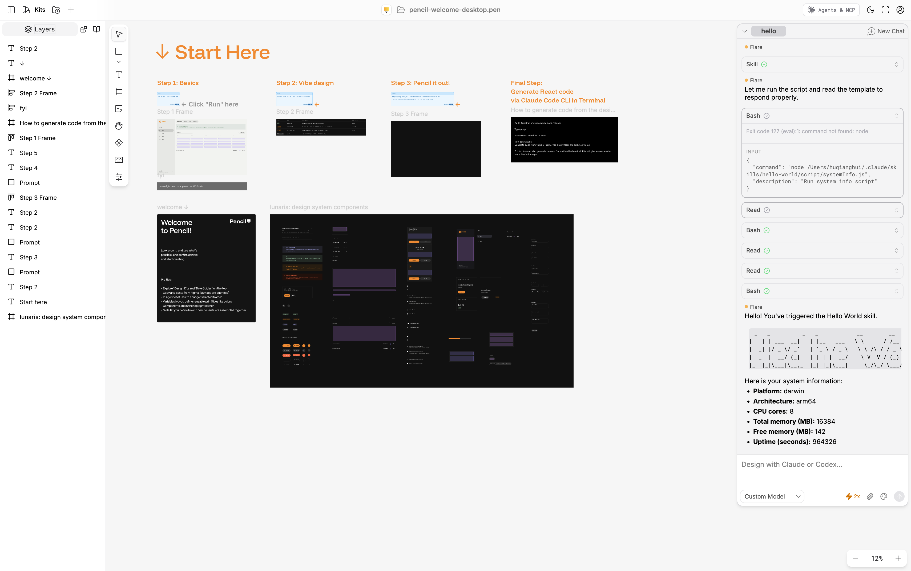

# Pencil 设计工具与 Claude Code 快速上手指南

> 从安装配置到 AI 辅助设计，再到代码生成的完整工作流

**Prompt 灵感库**：[pencil.dev/prompts](https://pencil.dev/prompts) — Pencil 官方提供的 Prompt Gallery，包含 12 个精选提示词模板，覆盖 Web App、网站、移动端、主题切换等场景。以下是几个推荐的高频提示词：

| 提示词 | 场景 | 说明 |
|-------|------|------|
| `Design a web app for managing rocket launches. Use a technical style.` | Web App 原型 | 从零生成完整 Web App，适合快速出仪表盘/管理后台原型 |
| `Design a website for a specialty cafe in Haight Ashbury, San Francisco.` | 网站设计 | 带地域风格的品牌网站，适合展示页/Landing Page |
| `Design a mobile app for tracking music royalties. Use a Scandinavian minimalistic style.` | 移动端设计 | 指定设计风格（北欧极简），适合消费者应用 |
| `Look at the selected design. Change it to the light mode.` | 主题切换 | 选中已有设计后执行，一键切换明暗主题 |
| `Look at the selected design. Explore a totally different design direction.` | 设计探索 | 基于现有设计生成完全不同的方向，适合 A/B 对比 |
| `Look at the selected design. Explore a different layout, but keep the current design direction.` | 布局变体 | 保持风格不变，只改布局结构，适合响应式适配探索 |
| `Look at the selected design. Change this to a simpler and cleaner design direction.` | 设计简化 | 精简现有设计，去除多余装饰，适合迭代优化 |

> **使用技巧**：这些提示词可以直接放在画布的 **Prompt 便签**（详见第十二章）中点击 Run 执行，也可以在 Pencil 侧边栏的 Claude Code 聊天中输入。组合使用效果更佳——先用「Web App 原型」生成初版，再用「布局变体」和「设计简化」迭代。

---

## 一、Pencil 是什么

Pencil 是一款面向 AI 时代的设计工具，核心理念是**让 AI Agent 直接参与设计流程**。与 Figma 的插件式 AI 集成不同，Pencil 通过 MCP（Model Context Protocol）Server 将设计画布完全暴露给 Claude Code，实现了真正的「AI 在画布上设计」体验。

**Pencil 的核心特点**：
- `.pen` 文件格式 — 加密的 JSON-based 设计文件，只能通过 Pencil MCP 工具访问
- MCP Server 原生集成 — Claude Code 可以直接读写 `.pen` 文件中的节点
- 组件系统 — 支持可复用组件（reusable）、Slot 插槽、design token 变量
- 代码生成 — 从设计稿直接生成 React + Tailwind 代码
- Figma 互操作 — 可以从 Figma 导入设计，也可以导出到 Figma

**与 Figma 的定位区别**：

| 维度 | Figma | Pencil |
|------|-------|--------|
| AI 集成方式 | 插件 + Figma MCP Server | 原生 MCP，AI 直接操作画布 |
| 文件格式 | .fig（云端） | .pen（本地 JSON，加密） |
| 设计哲学 | 人类手动设计，AI 辅助 | AI 生成设计，人类微调 |
| 代码生成 | 需要第三方工具 | 内置工作流（.pen → React） |
| 适合场景 | 团队协作、精细设计 | AI 快速原型、设计到代码 |

---

## 二、安装与配置

### 2.1 安装 Pencil 桌面应用

从 [Pencil 官网](https://pencil.li) 下载桌面应用（支持 macOS / Windows / Linux）。

### 2.2 连接 Claude Code

1. 打开 Pencil → **Settings** → **Agents**
2. 在 **Agents on Canvas** 中找到 **Anthropic Claude Code**
3. 点击 **Connect** — 状态变为 ✅ **Connected via custom provider**
4. 底部可看到提示：`Set model ID and additional variables in settings.json`



连接成功后，Pencil 会在右侧面板显示 Claude Code 的聊天界面，可以直接在设计画布旁与 AI 对话。



### 2.3 MCP 配置

Pencil 的 MCP Server 会自动注册到 Claude Code 中。安装完成后，Claude Code 可以使用以下 MCP 工具前缀访问 Pencil：

```
mcp__pencil__batch_design      # 批量设计操作（插入/更新/删除/移动）
mcp__pencil__batch_get         # 读取节点和搜索
mcp__pencil__get_editor_state  # 获取当前编辑器状态
mcp__pencil__get_screenshot    # 截图验证
mcp__pencil__get_guidelines    # 获取设计指南
mcp__pencil__get_style_guide   # 获取风格参考
mcp__pencil__export_nodes      # 导出为 PNG/JPEG/PDF
mcp__pencil__get_variables     # 获取设计变量
mcp__pencil__set_variables     # 设置设计变量
mcp__pencil__open_document     # 打开或新建 .pen 文件
mcp__pencil__snapshot_layout   # 检查布局结构
mcp__pencil__find_empty_space_on_canvas  # 画布空间查找
```

> **重要**：`.pen` 文件是加密的，**不能**使用 `Read`、`Grep` 等常规文件工具读取，**只能**通过 Pencil MCP 工具操作。

---

## 三、Start Here — 四步入门教程

Pencil 自带 `pencil-welcome-desktop.pen` 文件，包含四步引导：

### Step 1: Basics（基础操作）
- 了解画布、图层面板、属性面板
- 学习基本的框架（frame）、文本（text）、矩形（rectangle）等元素类型
- 点击 "Run" 按钮可执行内置示例

### Step 2: Vibe Design（氛围设计）
- 用自然语言描述你想要的设计风格
- AI 根据描述生成完整的页面布局
- 通过 `get_style_guide` 获取设计灵感和配色方案

### Step 3: Pencil It Out（精细调整）
- 在 AI 生成的基础上进行微调
- 使用组件系统替换和自定义元素
- 通过 `batch_design` 进行精确的属性修改

### Step 4: Generate React Code（代码生成）
- 从 .pen 设计稿生成 React + Tailwind 代码
- 通过 Claude Code CLI 在终端中执行代码生成
- 导出的代码可直接在项目中使用

---

## 四、核心概念

### 4.1 节点类型

Pencil 的设计元素都是**节点（node）**，每个节点有唯一 `id` 和 `type`：

| 类型 | 说明 | 用途 |
|------|------|------|
| `frame` | 容器框架 | 布局容器、页面、卡片 |
| `text` | 文本 | 标题、正文、标签 |
| `rectangle` | 矩形 | 背景、分隔线 |
| `ellipse` | 椭圆 | 头像、装饰 |
| `icon_font` | 图标字体 | Lucide / Material 图标 |
| `ref` | 组件实例 | 引用可复用组件 |
| `image` | 图片 | 不能直接创建，用 G() 操作 |
| `path` | 路径 | SVG 路径 |
| `group` | 分组 | 逻辑分组 |

### 4.2 组件系统（Reusable Components）

Pencil 的组件系统是其核心设计能力：

**定义组件**：设置 `reusable: true` 的节点成为可复用组件
```json
{
  "id": "button-primary",
  "type": "frame",
  "reusable": true,
  "children": [
    {"id": "icon", "type": "icon_font", "iconFontName": "plus"},
    {"id": "label", "type": "text", "content": "Button"}
  ]
}
```

**使用组件**：通过 `ref` 类型引用
```javascript
// 插入组件实例
btn=I(container, {type: "ref", ref: "button-primary"})

// 覆盖子节点属性（通过 descendants）
btn=I(container, {type: "ref", ref: "button-primary", descendants: {
  "icon": {iconFontName: "settings"},
  "label": {content: "Settings"}
}})

// 或通过 Update 操作覆盖
U(btn+"/label", {content: "Click Me"})
```

### 4.3 Slot 插槽机制

Slot 是组件中预留的内容插入点：

```javascript
// 组件定义中的 slot
{
  "id": "card",
  "reusable": true,
  "children": [
    {"id": "headerSlot", "slot": ["titleCompId"]},   // 可插入推荐组件
    {"id": "contentSlot", "slot": []},                // 自由内容区
    {"id": "actionsSlot", "slot": ["buttonId"]}       // 按钮区
  ]
}

// 向 slot 中插入内容
card=I(page, {type: "ref", ref: "card"})
title=I(card+"/headerSlot", {type: "text", content: "My Card"})
btn=I(card+"/actionsSlot", {type: "ref", ref: "button-primary"})

// 隐藏不需要的 slot
U(card+"/actionsSlot", {enabled: false})
```

### 4.4 Design Token 变量

Pencil 使用 `$--variable` 语法引用设计变量，实现主题一致性：

**颜色变量**：
| Token | 用途 |
|-------|------|
| `$--background` | 页面背景 |
| `$--foreground` | 主要文字 |
| `$--muted-foreground` | 次要文字 |
| `$--primary` | 品牌主色 |
| `$--border` | 边框 |
| `$--card` | 卡片背景 |
| `$--destructive` | 危险操作 |

**字体变量**：
| Token | 用途 |
|-------|------|
| `$--font-primary` | 标题、导航 |
| `$--font-secondary` | 正文、描述 |

**圆角变量**：
| Token | 用途 |
|-------|------|
| `$--radius-none` | 表格、尖角容器 |
| `$--radius-m` | 卡片、弹窗 |
| `$--radius-pill` | 按钮、输入框 |

通过 `get_variables` 和 `set_variables` 工具管理变量和主题。

---

## 五、常用操作速查

### 5.1 batch_design 操作语法

这是 Pencil 最核心的操作工具，支持六种操作：

```javascript
// Insert — 插入新节点
foo=I("parentId", {type: "frame", layout: "vertical", gap: 16})

// Copy — 复制节点
bar=C("sourceNodeId", "parentId", {name: "Copy of Source"})

// Update — 更新属性（不能改 type/id/ref）
U("nodeId", {fill: "$--primary", width: 200})

// Replace — 替换节点（可改 type）
baz=R("oldNodeId", {type: "text", content: "New Content"})

// Move — 移动节点到新位置
M("nodeId", "newParentId", 0)  // 第三参数是索引

// Delete — 删除节点
D("nodeId")

// Generate Image — AI 生成或搜索图片（应用为 fill）
G("frameId", "ai", "modern dashboard illustration")
G("frameId", "stock", "office workspace")
```

**关键规则**：
- 每次调用最多 **25 个操作**
- I()、C()、R() **必须**有 binding 名称（`foo=I(...)`)
- U() **不能**修改 `id`、`type`、`ref`
- 没有 `image` 节点类型 — 图片通过 G() 操作应用到 frame/rectangle 的 fill
- 操作按顺序执行，出错则全部回滚

### 5.2 读取与查询

```javascript
// 获取编辑器状态（开始任何任务前先调用）
get_editor_state(include_schema: true)

// 按模式搜索节点
batch_get(patterns: [{reusable: true}])           // 所有可复用组件
batch_get(patterns: [{type: "text"}])             // 所有文本节点
batch_get(patterns: [{name: "Header.*"}])         // 名称正则匹配
batch_get(nodeIds: ["id1", "id2"])                // 按 ID 批量读取

// 检查布局
snapshot_layout(parentId: "frameId", maxDepth: 2)

// 截图验证
get_screenshot(nodeId: "frameId")
```

### 5.3 常见布局模式

**Sidebar + Content（仪表盘）**：
```javascript
screen=I(document, {type: "frame", name: "Dashboard", layout: "horizontal",
  width: 1440, height: "fit_content(900)", fill: "$--background", placeholder: true})
sidebar=I(screen, {type: "ref", ref: "sidebarId", height: "fill_container"})
main=I(screen, {type: "frame", layout: "vertical",
  width: "fill_container", height: "fill_container(900)", padding: 32, gap: 24})
```

**Header + Content**：
```javascript
screen=I(document, {type: "frame", layout: "vertical",
  width: 1200, height: "fit_content(800)", fill: "$--background", placeholder: true})
header=I(screen, {type: "frame", layout: "horizontal",
  width: "fill_container", height: 64, padding: [0, 24],
  alignItems: "center", justifyContent: "space_between"})
content=I(screen, {type: "frame", layout: "vertical",
  width: "fill_container", height: "fit_content(736)", padding: 32, gap: 24})
```

**Card Grid（卡片网格）**：
```javascript
grid=I(container, {type: "frame", layout: "horizontal",
  width: "fill_container", gap: 16})
card1=I(grid, {type: "ref", ref: "cardId", width: "fill_container"})
card2=I(grid, {type: "ref", ref: "cardId", width: "fill_container"})
card3=I(grid, {type: "ref", ref: "cardId", width: "fill_container"})
```

### 5.4 图标使用

Pencil 支持多套图标字体：

```javascript
// Lucide 图标（推荐）
icon=I(container, {type: "icon_font",
  iconFontFamily: "lucide", iconFontName: "settings",
  width: 24, height: 24, fill: "$--foreground"})

// Material Symbols
icon=I(container, {type: "icon_font",
  iconFontFamily: "Material Symbols Rounded", iconFontName: "dashboard",
  width: 24, height: 24, fill: "$--foreground", weight: 400})

// 覆盖组件中的图标
btn=I(parent, {type: "ref", ref: "buttonId",
  descendants: {"iconId": {iconFontName: "home"}}})
```

常用图标映射：

| 功能 | Lucide | Material Symbols |
|------|--------|------------------|
| 首页 | `home` | `home` |
| 设置 | `settings` | `settings` |
| 用户 | `user` | `person` |
| 搜索 | `search` | `search` |
| 添加 | `plus` | `add` |
| 关闭 | `x` | `close` |
| 编辑 | `pencil` | `edit` |
| 删除 | `trash-2` | `delete` |

---

## 六、Claude Code 交互工作流

### 6.1 典型设计流程

```
1. get_editor_state()          → 了解当前画布状态
2. get_guidelines("web-app")   → 获取设计指南
3. get_style_guide_tags()      → 获取可用风格标签
4. get_style_guide(tags: [...])→ 获取配色和风格参考
5. batch_get(patterns: [{reusable: true}])  → 列出可用组件
6. batch_design(operations: "...")  → 执行设计操作
7. get_screenshot(nodeId: "...")    → 验证设计结果
8. 重复 6-7 直到满意
```

### 6.2 自然语言设计

在 Pencil 的聊天面板中直接用自然语言描述需求：

```
"创建一个用户管理仪表盘，左侧导航栏，右侧包含用户列表表格和搜索框"
```

Claude Code 会自动：
1. 查询可用的设计系统组件
2. 选择合适的布局模式
3. 通过 `batch_design` 构建完整页面
4. 用 `get_screenshot` 验证效果

### 6.3 小修改技巧

**修改文本内容**：
```javascript
U("textNodeId", {content: "New Text"})
```

**修改颜色**：
```javascript
U("nodeId", {fill: "$--primary"})       // 背景色
U("textNodeId", {fill: "$--foreground"})  // 文字色
```

**调整间距**：
```javascript
U("containerNodeId", {gap: 16, padding: 24})
U("containerNodeId", {padding: [12, 24]})  // [垂直, 水平]
```

**调整尺寸**：
```javascript
U("nodeId", {width: 300, height: 200})
U("nodeId", {width: "fill_container"})     // 填充父容器
U("nodeId", {width: "fit_content"})        // 适应内容
```

**隐藏元素**：
```javascript
U("nodeId", {enabled: false})
```

### 6.4 批量替换

使用 `replace_all_matching_properties` 进行全局样式替换：

```javascript
// 全局替换颜色
replace_all_matching_properties(
  parents: ["screenId"],
  properties: {
    fillColor: [{from: "#FF0000", to: "#3b82f6"}],
    fontSize: [{from: 14, to: 16}]
  }
)
```

---

## 七、.pen 文件管理

### 7.1 文件操作

```javascript
// 打开现有文件
open_document("/path/to/design.pen")

// 新建空白文件
open_document("new")
```

### 7.2 导出

```javascript
// 导出为 PNG
export_nodes(
  nodeIds: ["screenId"],
  outputDir: "/path/to/output",
  format: "png",
  scale: 2       // 2x 高清
)

// 导出为 PDF（多个节点合并为多页）
export_nodes(
  nodeIds: ["page1", "page2", "page3"],
  outputDir: "/path/to/output",
  format: "pdf"
)

// 导出为 JPEG（指定质量）
export_nodes(
  nodeIds: ["screenId"],
  outputDir: "/path/to/output",
  format: "jpeg",
  quality: 90
)
```

### 7.3 本地保存注意事项

- `.pen` 文件保存在本地磁盘，**不会**自动上传到云端
- 文件内容加密，**只能**通过 Pencil 应用或 MCP 工具访问
- 建议将 `.pen` 文件纳入 Git 版本管理（文件本身是二进制的，但可以追踪变更）
- 在 Pencil 中 Cmd+S（macOS）/ Ctrl+S（Windows）保存

---

## 八、代码生成工作流

### 8.1 从设计到 React 代码

这是 Pencil 的核心价值链路：

```
.pen 设计稿 → Claude Code 分析 → React + Tailwind 代码
```

**步骤**：

1. **分析组件** — 用 `batch_get` 读取设计帧中的所有组件实例
2. **提取组件定义** — 获取每个可复用组件的完整结构
3. **生成 React 组件** — 逐一转换为 `.tsx` 文件
4. **验证** — 用 `get_screenshot` 对比设计稿和渲染结果
5. **组装页面** — 将组件实例组合为完整页面

### 8.2 代码生成关键原则

- **使用项目已有框架** — 如果项目用 React，就生成 React；如果用 Vue，就生成 Vue
- **使用项目已有样式方案** — 优先使用 Tailwind class，避免内联样式
- **使用 CSS 变量** — 颜色使用 `var(--primary)` 而非硬编码 `#3b82f6`
- **精确还原** — 文本、图标、间距必须与设计稿一致
- **SVG 提取** — 使用 `batch_get(includePathGeometry: true)` 获取精确路径

### 8.3 Tailwind 实现对照

| .pen 属性 | Tailwind 对应 |
|-----------|--------------|
| `layout: "horizontal"` | `flex flex-row` |
| `layout: "vertical"` | `flex flex-col` |
| `gap: 16` | `gap-4` |
| `padding: 24` | `p-6` |
| `padding: [12, 24]` | `py-3 px-6` |
| `width: "fill_container"` | `flex-1` 或 `w-full` |
| `width: "fit_content"` | `w-fit` |
| `alignItems: "center"` | `items-center` |
| `justifyContent: "space_between"` | `justify-between` |
| `cornerRadius: [8,8,8,8]` | `rounded-lg` |

---

## 九、Figma 与 Pencil 互操作

### 9.1 从 Figma 导入

Pencil 支持从 Figma 导入设计：
1. 在 Figma 中选择要导入的组件或页面
2. 通过 Figma MCP 的 `get_design_context` 获取设计数据
3. 用 Pencil 的 `batch_design` 在 `.pen` 文件中重建

### 9.2 工作流建议

| 场景 | 推荐工具 |
|------|---------|
| 团队协作设计 | Figma（云端实时协作） |
| AI 快速原型 | Pencil（AI 直接操作画布） |
| 设计到代码 | Pencil → Claude Code → React |
| 精细视觉设计 | Figma（手动调整更精确） |
| 设计系统维护 | Figma（成熟的组件库生态） |

### 9.3 两者配合的最佳实践

1. **Figma 做高保真设计** — 品牌视觉、复杂交互、团队评审
2. **Pencil 做快速实现** — 从 Figma 导入关键组件，用 AI 批量生成页面变体
3. **Claude Code 做代码桥梁** — 同时连接 Figma MCP 和 Pencil MCP，实现设计资产的双向流转

---

## 十、常见问题与技巧

### Q1: .pen 文件打不开？
确保使用 Pencil 桌面应用打开，不要用文本编辑器。`.pen` 文件是加密格式。

### Q2: Claude Code 无法操作 .pen 文件？
检查 Settings → Agents 中 Claude Code 是否显示 "Connected"。如果断开，重新点击 Connect。

### Q3: 设计中的组件找不到？
先用 `batch_get(patterns: [{reusable: true}])` 列出所有可用组件，确认组件 ID。不同的设计系统（Design Kit）提供不同的组件集。

### Q4: 如何使用自定义设计系统？
1. 在 Pencil 中导入 Design Kit（.pen 格式的组件库）
2. 用 `batch_get` 搜索 `reusable: true` 的组件
3. 用 `get_guidelines("design-system")` 获取组件组合指南

### Q5: 生成的图片模糊？
导出时设置 `scale: 2` 或更高值获取高清图片。默认 2x 分辨率，最大 4096px。

### Q6: 如何检查设计是否有问题？
使用 `snapshot_layout(problemsOnly: true)` 只返回存在裁切、溢出等问题的节点。

### Q7: 如何获取设计灵感？
```javascript
get_style_guide_tags()                    // 查看可用风格标签
get_style_guide(tags: ["modern", "clean", "webapp", "dashboard", ...])  // 获取配色方案
```

---

## 十一、快速参考卡片

### 操作速查

| 操作 | 语法 | 说明 |
|------|------|------|
| 插入 | `foo=I(parent, {...})` | 新增节点 |
| 复制 | `bar=C(source, parent, {...})` | 复制节点 |
| 更新 | `U(path, {...})` | 修改属性 |
| 替换 | `baz=R(path, {...})` | 替换节点 |
| 移动 | `M(nodeId, parent, index)` | 移动位置 |
| 删除 | `D(nodeId)` | 删除节点 |
| 图片 | `G(nodeId, "ai"/"stock", prompt)` | 生成/搜索图片 |

### 尺寸模式

| 值 | 含义 |
|----|------|
| `200` | 固定 200px |
| `"fill_container"` | 填充父容器 |
| `"fit_content"` | 适应内容大小 |
| `"fill_container(900)"` | 填充但最小 900px |
| `"fit_content(400)"` | 适应内容但最小 400px |

### 间距参考

| 场景 | Gap | Padding |
|------|-----|---------|
| 页面区块 | 24-32 | — |
| 卡片网格 | 16-24 | — |
| 表单字段 | 16 | — |
| 按钮组 | 12 | — |
| 卡片内部 | — | 24 |
| 页面内容区 | — | 32 |

---

## 十二、画布便签系统 — Note / Prompt / Context

Pencil 在画布上提供了三种特殊的「便签」节点类型，用于注释、AI 指令和上下文说明。这是 Pencil 区别于传统设计工具的核心交互方式之一。

### 12.1 三种便签类型

| 类型 | 节点类型 | 功能 | 类比 |
|------|---------|------|------|
| **Note** | `note` | 设计注释便签 | Figma 的 Sticky Note |
| **Prompt** | `prompt` | AI 指令便签（可点击 Run 执行） | ChatGPT 对话框 |
| **Context** | `context` | 上下文信息便签（AI 参考但不执行） | 代码注释 |

### 12.2 Prompt 便签（核心功能）

Prompt 便签是 Pencil 最独特的功能——**在画布上放置一个黄色便签，写入自然语言指令，点击 "Run" 按钮就能让 AI 执行设计操作**。

**Schema 定义**：
```typescript
interface Prompt extends Entity, Size, TextStyle {
  type: "prompt";
  content?: TextContent;    // 指令内容
  model?: StringOrVariable; // 指定 AI 模型（如 "cursor-composer"）
}
```

**实际示例**（来自 Pencil 内置 Demo 文件）：

```javascript
// 示例 1：修改现有设计
{
  type: "prompt",
  content: "Turn the \"Step 1 Frame\" into dark mode.",
  model: "cursor-composer"
}

// 示例 2：填充数据
{
  type: "prompt",
  content: "Add 3 more rows to the Step 2 Frame with some funny rover names.",
  model: "cursor-composer"
}

// 示例 3：生成完整仪表盘
{
  type: "prompt",
  content: "Design a dashboard in the \"Step 3 Frame\" for a rover management platform using the components\n- add a sidebar for navigation\n- add rover stats and table with available rovers for rent in the content body",
  model: "cursor-composer"
}
```

**实战截图**——使用 Prompt 便签让 AI 替换指定位置的图片为水波纹纹理：


> 截图说明：左侧画布中可以看到 Prompt 便签（蓝色高亮），内容为「replace all 6 album cover images with water ripple/wave texture images」。右侧 Claude Code 聊天面板显示 AI 在执行过程中**反复确认每张图片的位置**（通过 `batch_get` 读取节点、`get_screenshot` 截图验证），然后逐一使用 `G()` 操作替换为水波纹纹理图片。这体现了 Prompt 便签的典型工作流：指定目标区域 → AI 定位确认 → 执行修改 → 截图验证。

**使用方式**：

1. 在画布空白区域放置 Prompt 便签
2. 用自然语言写入设计指令（引用画布上的 frame 名称）
3. 点击便签上的 **Run** 按钮
4. AI Agent 读取指令并在对应 frame 中执行设计操作

**通过 MCP 创建 Prompt 便签**：
```javascript
// 在画布上创建一个 Prompt 便签
prompt1=I(document, {
  type: "prompt",
  content: "Design a login page in the \"Login Frame\" with email, password fields and social login buttons",
  model: "cursor-composer",
  x: 100, y: -200,
  width: 400, height: 219
})
```

### 12.3 Note 便签（设计注释）

Note 便签用于在画布上添加**人类可读的注释**，不会被 AI 执行。适合标注设计决策、交互说明、设计审查意见等。

```javascript
// 创建设计注释
note1=I(document, {
  type: "note",
  content: "这个卡片的间距需要与设计规范保持一致：padding 24px, gap 16px",
  x: 500, y: -100,
  width: 300, height: 150,
  fontSize: 14
})
```

### 12.4 Context 便签（AI 上下文）

Context 便签为 AI 提供**背景信息和约束条件**，AI 在执行 Prompt 时会参考 Context 便签的内容，但不会将其作为指令执行。

```javascript
// 提供设计约束上下文
ctx1=I(document, {
  type: "context",
  content: "品牌色：#3B82F6（蓝色系）\n目标用户：企业管理者\n设计风格：简洁专业\n必须使用 shadcn 组件库",
  x: 100, y: -400,
  width: 400, height: 200
})
```

### 12.5 三种便签的协作模式

在实际项目中，三种便签可以组合使用：

```
画布布局示意：

┌─────────────────────────────────────────────────────┐
│  [Context 便签]                                       │
│  品牌色：#3B82F6                                      │
│  风格：简洁专业                                        │
│  组件库：shadcn                                        │
├─────────────────────────────────────────────────────┤
│                                                       │
│  [Prompt 便签 ▶ Run]          [Note 便签]             │
│  在下方 frame 中设计            审查意见：              │
│  一个用户管理仪表盘              登录按钮需要更醒目       │
│                                                       │
│  ┌─────────────────────────────────────────────┐      │
│  │  Dashboard Frame                             │      │
│  │  （AI 在这里生成设计）                         │      │
│  └─────────────────────────────────────────────┘      │
└─────────────────────────────────────────────────────┘
```

**工作流**：
1. 先放置 **Context 便签**——定义全局约束（品牌色、风格、组件库）
2. 创建空白 **Frame**——作为设计画布
3. 放置 **Prompt 便签**——引用 frame 名称，描述设计需求
4. 点击 **Run** 执行——AI 参考 Context，在 Frame 中生成设计
5. 添加 **Note 便签**——标注审查意见或修改建议
6. 放置新的 **Prompt 便签**——基于 Note 的反馈进行迭代

> **提示**：Prompt 便签中引用 frame 时使用**双引号包裹 frame 名称**（如 `"Step 1 Frame"`），确保 AI 能准确定位目标区域。

---

## 十三、内置 Design Kit 系统对比

Pencil 内置了四套 Design Kit（设计系统组件库），每套都是一个 `.pen` 文件，包含 80+ 个可复用组件。它们共享相同的组件分类体系（Button、Card、Input、Table、Sidebar、Modal 等），但**视觉风格迥异**。

### 13.1 四套 Kit 概览

| Kit | 视觉关键词 | 圆角策略 | 适合场景 |
|-----|-----------|---------|---------|
| **shadcn** | 简洁、开发者友好、中性 | `cornerRadius: 6`（统一圆角） | SaaS 后台、开发者工具、管理面板 |
| **Lunaris** | 优雅、杂志感、对比鲜明 | 按钮 `$--radius-pill`（药丸形），卡片 `$--radius-none`（直角） | 编辑后台、数据分析面板、高端产品 |
| **Nitro** | 锐利、工业感、高信息密度 | `$--radius-none`（全部直角） | 企业级 ERP、工程仪表盘、监控系统 |
| **Halo** | 圆润、亲和、消费者导向 | 按钮/标签 `$--radius-pill`，卡片 `$--radius-l`，弹窗 `$--radius-m` | 消费者应用、社交平台、教育产品 |

### 13.2 组件清单对比

四套 Kit 都包含以下核心组件，但各有侧重和特色变体：

**通用组件（四套 Kit 共有）**：

| 组件分类 | 包含组件 |
|---------|---------|
| 按钮 | Button（Default / Secondary / Destructive / Outline / Ghost）× 尺寸变体 |
| 输入 | Input、Textarea、Select、Checkbox、Radio、Switch、Slider |
| 卡片 | Card（含 Header / Content / Actions 三个 Slot） |
| 导航 | Sidebar、Tabs、Breadcrumb |
| 数据展示 | Data Table、Badge、Avatar |
| 反馈 | Dialog、Modal、Toast / Alert |
| 表单 | Form Group（Label + Input + Helper Text） |

**各 Kit 特色组件**：

| 特色能力 | shadcn | Lunaris | Nitro | Halo |
|---------|--------|---------|-------|------|
| 按钮变体 | 5 种样式 × Normal/Large/Icon | 5 种样式 + 渐变变体 | 5 种样式，Ghost 用 `$--accent` 填充 | 5 种样式 + 胶囊形状 |
| Icon Label（彩色标签） | ✗ | ✓ Success/Orange/Violet/Secondary | ✗ | ✗ |
| Alert 彩色变体 | 基础样式 | ✓ Info/Success/Warning/Error 各有独立配色 | 基础样式 | 基础样式 |
| Checkbox/Radio 描述变体 | ✗ | ✓ 含 Description 二级说明 | ✗ | ✗ |
| Sidebar 活跃态标识 | 背景高亮 | 背景高亮 | **左边框强调**（`stroke.thickness.left: 2`） | 高圆角背景（`cornerRadius: 24`） |
| 组件上下文注释 | ✗ | ✗ | ✓ `context` 字段描述用途 | ✗ |
| Tab 间距 | 紧凑 | 标准 | 紧凑 | 宽松（`padding: [10, 24]`） |
| 卡片背景 | `$--card` | `$--card` | `$--card` | `$--tile`（独立变量） |

### 13.3 视觉差异的核心：圆角策略

**圆角（cornerRadius）是区分四套 Kit 视觉风格最直观的维度**：

```
shadcn:   ┌──────────┐    统一 6px 圆角 — 中性、现代
          │  Button   │
          └──────────┘

Lunaris:  ╭──────────╮    药丸形按钮 + 直角卡片 — 优雅对比
          │  Button   │
          ╰──────────╯    ┌──────────┐
                          │   Card   │
                          └──────────┘

Nitro:    ┌──────────┐    全部直角 — 锐利、工程感
          │  Button   │
          └──────────┘

Halo:     ╭──────────╮    多级圆角 — 按钮药丸形、卡片大圆角
          │  Button   │
          ╰──────────╯    ╭──────────╮
                          │   Card   │
                          ╰──────────╯
```

### 13.4 选择建议

| 你的项目是… | 推荐 Kit | 理由 |
|------------|---------|------|
| B2B SaaS / 开发者工具 | **shadcn** | 最接近 shadcn/ui 生态，组件映射最直接 |
| 数据分析仪表盘 | **Lunaris** | 彩色 Icon Label 和 Alert 适合数据状态展示 |
| 企业内部系统 / ERP | **Nitro** | 直角设计提高信息密度，左边框导航清晰 |
| 消费者应用 / 教育平台 | **Halo** | 圆润亲和，适合面向终端用户的产品 |
| 快速原型 / 不确定风格 | **shadcn** | 最中性的默认选择，后续可切换 |

### 13.5 Kit 切换与自定义

**查看当前 Kit 组件**：
```javascript
// 列出所有可复用组件
batch_get(patterns: [{reusable: true}], readDepth: 2)
```

**全局风格替换**（从一套 Kit 切换到另一套的视觉风格）：
```javascript
// 例：将 shadcn 的圆角替换为 Nitro 的直角
replace_all_matching_properties(
  parents: ["screenId"],
  properties: {
    cornerRadius: [{from: [6,6,6,6], to: [0,0,0,0]}]
  }
)
```

**自定义设计变量**：
```javascript
// 修改全局变量实现品牌定制
set_variables(variables: {
  "$--primary": "#your-brand-color",
  "$--radius-m": "8",
  "$--font-primary": "your-font"
})
```

> **提示**：四套 Kit 的组件 `id` 命名不同，如果需要在项目中切换 Kit，建议在项目初期就确定 Kit 选型，避免后期批量替换。

---

## 十四、动态图与 PPT 演示工作流

### 14.1 Pencil 的导出能力

Pencil 当前支持的导出格式：

| 格式 | 用途 | 支持动画 |
|------|------|---------|
| **PNG** | 高清静态图（2x 分辨率） | ✗ |
| **JPEG** | 压缩图片（质量可调 1-100） | ✗ |
| **WEBP** | 现代格式（无损/有损） | ✗ |
| **PDF** | 多页文档（多节点合并为多页） | ✗ |

**结论：Pencil 本身不支持动画或动态图导出。** 它是一个**静态设计工具**，`.pen` 文件中没有动画时间线、过渡效果或交互状态机。

### 14.2 三种替代工作流

虽然 Pencil 不能直接生成动态 PPT 图，但结合 Claude Code 和其他工具，可以实现类似效果：

#### 方案一：Pencil 静态图 + PPT 动画（推荐）

这是最实用的方案——用 Pencil 设计高质量的静态图，然后在 PPT 中添加动画效果。

```
Pencil 设计 → export_nodes(format: "png", scale: 2)
           → 导入 PowerPoint
           → 使用 PPT 内置动画（淡入、飞入、路径动画等）
```

**适合场景**：架构图、流程图、对比图的逐步呈现

**技巧**：
- 将复杂图的每个步骤设计为独立的 frame，分别导出为 PNG
- 在 PPT 中使用「出现」动画按顺序展示
- 利用 Pencil 的 `find_empty_space_on_canvas` 将变体排列在画布上

```javascript
// 导出流程图的 4 个步骤
export_nodes(
  nodeIds: ["step1", "step2", "step3", "step4"],
  outputDir: "/path/to/ppt-assets",
  format: "png",
  scale: 2
)
```

#### 方案二：Pencil 设计 → 代码生成 → 动态组件

Pencil 支持将设计稿生成为 React / Vue / Svelte 代码。生成后，可以添加动画库实现动态效果，再录屏嵌入 PPT。

```
Pencil 设计 → get_guidelines("code")
           → Claude Code 生成 React 组件
           → 添加 Framer Motion / GSAP 动画
           → 录屏 → 嵌入 PPT 为视频
```

**适合场景**：产品 Demo 演示、交互原型展示

**支持的代码生成目标**：

| 框架 | 样式方案 | 组件库映射 |
|------|---------|-----------|
| React / Next.js | Tailwind CSS | Shadcn UI、Radix UI、Chakra UI、Material UI |
| Vue | Tailwind CSS / CSS Modules | — |
| Svelte | Tailwind CSS | — |
| HTML/CSS | 原生 CSS / Tailwind | — |

#### 方案三：Claude Code 直接生成动态图

如果目标是流程图、架构图等**图表类型**的动态效果，可以完全绕过 Pencil，让 Claude Code 直接生成：

| 工具 | 输出格式 | 动画能力 | 适合 PPT |
|------|---------|---------|---------|
| **Mermaid.js** | SVG | ✗（静态） | 导出为 SVG/PNG 后嵌入 |
| **D3.js** | SVG/Canvas | ✓（完整动画） | 录屏后嵌入为视频 |
| **Excalidraw** | SVG/PNG | ✗（静态手绘风格） | 导出 PNG 后嵌入 |
| **Draw.io** | SVG/PNG/XML | ✗（静态） | 导出后嵌入 |
| **Reveal.js** | HTML 幻灯片 | ✓（CSS 过渡动画） | 替代 PPT 方案 |
| **PPTX-GenJS** | .pptx 文件 | ✓（PPT 原生动画） | 直接生成 PPT |

**最佳组合建议**：

```
架构图/流程图 → Pencil 设计（高保真） → 导出 PNG → PPT 动画
数据可视化   → Claude Code 生成 D3.js → 录屏 → PPT 视频
Demo 演示    → Pencil 设计 → 生成 React + Framer Motion → 录屏
全替代方案   → Claude Code 生成 Reveal.js 幻灯片（支持代码高亮 + 动画）
```

### 14.3 实用脚本：批量导出为 PPT 素材

```javascript
// Step 1: 查找所有顶层 frame（每个 frame 视为一页/一步）
batch_get(patterns: [{type: "frame"}], searchDepth: 1)

// Step 2: 批量导出
export_nodes(
  nodeIds: ["frame1", "frame2", "frame3", "frame4"],
  outputDir: "/Users/huqianghui/Desktop/ppt-slides",
  format: "png",
  scale: 2    // 2x 高清，适合全屏投影
)

// Step 3: 导出 PDF（作为备份打印版）
export_nodes(
  nodeIds: ["frame1", "frame2", "frame3", "frame4"],
  outputDir: "/Users/huqianghui/Desktop/ppt-slides",
  format: "pdf"
)
```

> **总结**：Pencil 的核心价值在于**AI 驱动的高质量静态设计**，而非动画制作。对于 PPT 演示，最实用的方案是「Pencil 设计静态图 → 导出高清 PNG → PPT 中添加动画」。如果需要真正的动态效果，建议走「Pencil 设计 → 代码生成 → 动画库 → 录屏」的路线。

---

#### 相关笔记

- [[AI-Native开发实践：从Figma设计到Superpowers Brainstorm再到Spec-Delta工作流]]
- [[Claude Code扩展三剑客：Command、Skill与Agent的区别与协作]]
- [[在Obsidian中用Excalidraw与Draw.io绘制Azure架构图实战指南]]
- [[架构师视角的AI Harness Engineering最佳实践]]

#### 参考链接

- Pencil 官网: [pencil.li](https://pencil.li)
- Pencil MCP 文档: 通过 `get_guidelines()` 工具访问
- Claude Code MCP 集成: [docs.anthropic.com](https://docs.anthropic.com)
