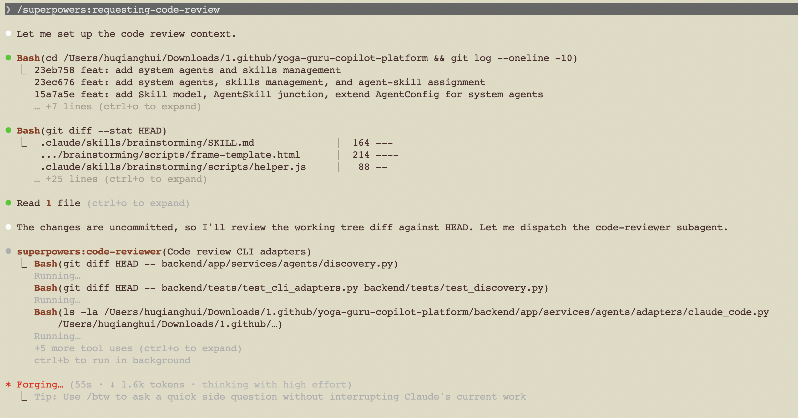

## 背景：Figma 画完了，然后呢？

在使用 Claude Code 开发 yoga-guru-copilot-platform 项目时，我遇到了一个典型问题：

**Figma 设计稿画好了，但直接丢给 AI 写代码，结果一塌糊涂。**

AI 会疯狂写代码，但写出来的东西和设计意图南辕北辙。缺的不是 coding 能力，而是**从设计到代码之间的"理解"环节**——需求是什么、架构怎么拆、先做什么后做什么。

这篇文章记录了我摸索出的一条实践路径：**用 Superpowers 的 Brainstorm 做设计到需求的桥梁，再用 OpenSpec 的 Spec-Delta 做增量迭代**。整条路径解决的核心问题是——如何让 AI 在正确理解需求的前提下写代码。

---

## 核心工作流：三个阶段、三种思维

```
阶段一：Design（发散）        阶段二：Brainstorm（收敛）      阶段三：Spec-Delta（迭代）
┌──────────────┐         ┌──────────────────┐         ┌──────────────────┐
│   Figma       │  ──→   │  Superpowers      │  ──→   │  OpenSpec         │
│   画什么样     │         │  brainstorm       │         │  Spec Delta       │
│               │         │  做什么、为什么做    │         │  每次改什么        │
│  视觉 + 交互   │         │  需求 + 架构       │         │  增量变更 + 实现    │
└──────────────┘         └──────────────────┘         └──────────────────┘
  Design AI                 Spec AI                     Coding AI
```

**关键认知：这不是工具的串联，而是思维模式的转换。**

- **Figma** 回答的是"长什么样"——视觉层
- **Brainstorm** 回答的是"做什么、为什么做"——需求层
- **Spec-Delta** 回答的是"这次改什么"——变更层

每个阶段输出的 context 类型完全不同，喂给 AI 的信息质量也不同。

### 各工具的角色

| 工具 | 解决的问题 | 输出物 |
|---|---|---|
| **Figma** | 产品长什么样 | 设计稿、design tokens、组件树 |
| **Superpowers brainstorm** | 产品做什么、架构怎么拆 | 需求文档、模块划分、技术方案 |
| **OpenSpec** | 每次迭代改什么 | Spec Delta（ADDED/MODIFIED/REMOVED） |
| **Claude Code** | 代码怎么写 | 实现代码 + 测试 |

---

## 阶段一：Figma — 视觉设计，但仅此而已

Figma 能产出漂亮的设计稿，但**设计稿本身不包含足够的信息让 AI 写出好代码**。

### Figma 能给 AI 的

- **Design Tokens**：颜色、字体、间距
- **Component Tree**：组件层级结构
- **截图 / 视觉参考**

### Figma 给不了 AI 的

- 这个页面的**业务目的**是什么？
- 用户**操作流程**是什么？
- 组件之间的**数据关系**是什么？
- **先做哪个后做哪个**？
- **技术上怎么实现**？

> 这就是为什么 Figma → Claude Code 直接生成代码效果差的原因：AI 拿到的是"像素级信息"，缺的是"需求级信息"。

### 最佳实践：把 Figma 输出结构化

与其截图丢给 AI，不如导出一份结构化的 `ui-spec.md`：

```markdown
# Yoga Guru Copilot UI Spec

## Pages
- Landing / Dashboard / Session / Progress

## Components
- PoseAnalyzer / CoachChat / SessionTimeline / ProgressChart
```

但即便有了这份 UI Spec，它描述的仍然只是"界面长什么样"，不是"系统要做什么"。**这就是 Brainstorm 的价值所在。**

---

## 阶段二：Superpowers Brainstorm — 从"长什么样"到"做什么"

Superpowers（by [Jesse Vincent / obra](https://github.com/obra/superpowers)）是一个 Claude Code 的 Skill 插件。它有很多功能（TDD、Plan、Subagent 等），但在这条工作流里，**最核心的价值是 Brainstorm**。

### 为什么 Brainstorm 是整个链路中 ROI 最高的环节

Brainstorm 做的事情很简单：**在你动手写代码之前，强迫你（和 AI）先想清楚。**

它通过苏格拉底式提问，把 Figma 设计稿中隐含的需求挖出来：

```
你：我有这个 Yoga Copilot 的 Figma 设计，帮我做这个项目
  ↓
Brainstorm 会问：
  - 目标用户是谁？初学者还是教练？
  - 核心功能有哪些？pose 识别是实时的还是拍照后分析？
  - 技术栈选什么？为什么？
  - MVP 包含哪些功能？哪些可以后做？
  ↓
输出：
  - 用户角色定义
  - 功能模块划分
  - 技术架构方案
  - MVP scope
```

**这就是 Figma 到 Spec 之间缺失的桥梁。**

### 实际使用

```bash
/brainstorming

Project: yoga-guru-copilot-platform
I have a Figma design.
Core features: pose recognition, AI coach, session tracking, course library.
Help me analyze product structure and architecture.
```

Brainstorm 的输出质量取决于你喂给它的初始信息——Figma 的 UI Spec 就是很好的输入素材。

### Brainstorm 特别适合的场景

| 场景 | 为什么适合 |
|---|---|
| **从零开始的新项目** | 帮你从发散到收敛，梳理清楚做什么 |
| **MVP 快速验证** | 帮你砍需求，聚焦核心价值 |
| **Figma 设计已有，需要转化为开发需求** | 正好填补设计→代码之间的 gap |

### Brainstorm 之后：两条路

Brainstorm 产出的需求文档和架构方案，接下来有两种走法：

```
Brainstorm 输出
  ├─ 路径 A：Superpowers write-plan → execute-plan（subagent 模式）
  │           适合：初始 MVP 的全量开发
  │           代价：plan 写到代码级别，token 消耗大
  │
  └─ 路径 B：转化为 OpenSpec → 用 Spec Delta 迭代（推荐）
              适合：MVP 之后的功能迭代
              优势：需求级 context，轻量、人可 review
```

**本文推荐的路径：Brainstorm 做初始设计 → 转化为 OpenSpec → 后续用 Spec Delta 迭代。**

路径 A 的 subagent 架构有其适用场景（并行独立任务、角色对抗式 review、混合模型降成本），但对于 Vibe Coding（一个人 + 强模型）来说往往过重。详细分析见 [[Claude Code的Agent与Subagent架构解析——以Superpowers为例]]。

### Superpowers 的价值分层（基于实践）

| 价值层级 | 功能 | 实用度 |
|---|---|---|
| 最高 | brainstorming（设计思考） | ⭐⭐⭐⭐⭐ 本文核心 |
| 高 | systematic-debugging（系统调试） | ⭐⭐⭐⭐ |
| 高 | verification-before-completion | ⭐⭐⭐⭐ |
| 中 | code-review agent | ⭐⭐⭐ |
| 视场景 | subagent-driven-development | 并行独立任务 ⭐⭐⭐⭐；Vibe Coding ⭐⭐ |
| 视场景 | writing-plans（详细计划） | subagent 模式 ⭐⭐⭐⭐；强模型直接 coding ⭐⭐ |

---

## 阶段三：OpenSpec — 把 Brainstorm 的成果固化下来

Brainstorm 产出的需求文档和架构方案非常有价值，但它们存在一个问题：**它们活在 chat 里，下次对话就丢了**。

OpenSpec 解决的正是这个问题：**把 Brainstorm 的成果结构化地存到 repo 里**，让 AI 每次都能读取最新 spec 作为系统的真实定义。

### 从 Brainstorm 到 OpenSpec 的转化

```
Brainstorm 输出                    OpenSpec 格式
┌────────────────────┐            ┌────────────────────┐
│ 用户角色：初学者/教练  │    转化    │ specs/user-roles/   │
│ 核心功能：pose识别...  │  ──────→  │ specs/pose-analyzer/│
│ 技术方案：Next.js...  │            │ specs/yoga-session/ │
│ MVP scope          │            │ specs/dashboard/    │
└────────────────────┘            └────────────────────┘
       存在 chat 里                      存在 repo 里
       下次就丢了                        永久可读取
```

### 后续迭代：Spec Delta 而不是重新 Brainstorm

初始 spec 建立后，**每次功能迭代通过 Spec Delta 驱动**，而不是每次重新走 Brainstorm 全流程。

| 维度 | 重新 Brainstorm | Spec Delta |
|---|---|---|
| Context 层级 | 全量重新思考 | 增量变更（ADDED/MODIFIED/REMOVED） |
| Token 消耗 | 重（整个产品重新梳理） | 轻（只描述这次改什么） |
| 人类可读性 | 对话式，难回溯 | 结构化，可 review |
| 适合场景 | 初始设计、重大方向调整 | 功能迭代、增量开发 |

核心区别：**Brainstorm 回答"做什么"，Spec Delta 回答"这次改什么"**。Delta 对 context window 更友好，也更适合人来 review 和确认。

### OpenSpec 目录结构

```
openspec/
  specs/           # 当前系统的真实规范
    yoga-session/
      spec.md
    pose-analyzer/
      spec.md
  changes/         # 新功能变更提案
    add-pose-feedback/
      proposal.md
      design.md
      tasks.md
      specs/
        yoga-session/spec.md
```

### Spec Delta 的核心概念

每个新功能生成一个 **change**，其中包含 spec delta：

```markdown
## ADDED Requirements
### Requirement: Yoga session tracking
- Track session duration
- Record pose accuracy scores
- Generate session summary

## MODIFIED Requirements
### Requirement: Dashboard
- Add session history widget
```

Delta 使用三种标记：**ADDED** / **MODIFIED** / **REMOVED**，最终 merge 回主 spec。

### 为什么 OpenSpec 对 AI 开发至关重要

AI coding 最大的问题是：**需求在 chat 里，context 会丢失**。

OpenSpec 的核心思想是：**把需求存到 repo，而不是 chat**。这样 AI 每次都可以读取 `openspec/specs/` 作为系统的真实定义，确保一致性。

---

## 阶段四：Claude Code — 在正确 Context 下写代码

经过前三个阶段，Claude Code 拿到的不再是"一张截图"，而是：

- **来自 Figma**：UI 组件结构、Design Tokens
- **来自 Brainstorm**：业务目的、用户流程、架构方案
- **来自 OpenSpec**：结构化的 spec + 本次 delta

这就是这条工作流的核心价值：**AI 写代码之前，先有了正确的理解。**

基于 Spec Delta 的 tasks.md，Claude Code 执行实际编码。结合 TDD 流程：

```
1. 读取 spec delta 中的 tasks（知道要改什么）
2. 参考 specs/ 中的完整定义（知道系统是什么）
3. 写 failing test (RED)
4. 写最少代码让测试通过 (GREEN)
5. 重构代码保持测试通过 (REFACTOR)
6. Commit → spec delta merge 回主 spec
```

---

## 缺失的两个关键组件：Testing AI 与 Review AI

当前这条流水线覆盖了：

| 环节 | 状态 | 工具 |
|---|---|---|
| Design AI | ✅ 已有 | Figma |
| Spec AI | ✅ 已有 | Superpowers + OpenSpec |
| Coding AI | ✅ 已有 | Claude Code |
| **Testing AI** | ✅ 已有 | Playwright + AI test generation |
| **Review AI** | ✅ 已有 | Superpowers `code-reviewer` subagent |

### Testing AI 的理想形态

不仅是跑已有测试，而是：

- **自动生成测试用例**：基于 spec delta 自动推导应该测试什么
- **覆盖率分析**：确保 delta 涉及的所有路径都被覆盖
- **回归检测**：自动判断变更是否影响现有功能
- **E2E 测试编排**：基于用户流自动生成端到端测试

### Review AI 的实现方案

通过 Superpowers 的 `code-reviewer` subagent 实现了 Review AI 组件：

- **触发方式**：使用 `/superpowers:requesting-code-review` 命令
- **工作流程**：主 agent 收集 git diff 上下文 → 分发 `code-reviewer` subagent → subagent 独立审查代码变更 → 返回审查结果
- **审查能力**：代码质量、潜在 bug、架构一致性等
- **自定义规则**：可通过修改 `code-reviewer.md` 的 system prompt 添加项目特定的审查规则



> 详细的 Agent/Subagent 架构原理参见 [[Claude Code的Agent与Subagent架构解析——以Superpowers为例]]

### 下一步计划

- [x] 调研或搭建 Testing AI 组件，基于 Playwright + AI test generation ✅ 2026-03-15
- [x] 调研或搭建 Review AI 组件，基于 Superpowers `code-reviewer` subagent ✅ 2026-03-15
- [ ] 将完整的五层 AI pipeline 在 yoga-guru-copilot-platform 项目中跑通

---

## 完整 AI-Native Dev Stack (2026)

```
┌─────────────────────────────────────────────────┐
│              1. Design Layer (发散)               │
│            Figma → 视觉设计 + Design Tokens       │
│            输出：UI Spec（长什么样）                │
└─────────────────┬───────────────────────────────┘
                  ↓
┌─────────────────────────────────────────────────┐
│              2. Spec Layer (收敛)                 │
│        Superpowers brainstorm → 需求 + 架构       │
│        输出：初始 OpenSpec specs/（做什么）         │
└─────────────────┬───────────────────────────────┘
                  ↓
┌─────────────────────────────────────────────────┐
│              3. Change Layer (迭代)               │
│    OpenSpec changes/ → Spec Delta → tasks.md     │
│    输出：增量变更（这次改什么）                      │
└─────────────────┬───────────────────────────────┘
                  ↓
┌─────────────────────────────────────────────────┐
│              4. Code Layer (实现)                 │
│           Claude Code → TDD 实现                 │
│           输出：代码 + 测试                        │
└─────────────────┬───────────────────────────────┘
                  ↓
┌─────────────────────────────────────────────────┐
│              5. Verification Layer (✅ 已建设)      │
│  Testing AI (Playwright) + Review AI (Superpowers)│
│         输出：质量保证                             │
└─────────────────────────────────────────────────┘
```

---

## 关键 Takeaways

1. **Figma 到代码之间缺的不是 coding 能力，而是"理解"环节**。设计稿给 AI 的是像素级信息，AI 需要的是需求级信息。Brainstorm 就是这个桥梁。
2. **Superpowers brainstorm 是整条链路中 ROI 最高的环节**。做 MVP 和初始设计时，brainstorm 的苏格拉底式提问远比直接写代码有效——它强迫你在动手之前先想清楚。
3. **三个阶段解决三个不同的问题**：Figma 回答"长什么样"（发散），Brainstorm 回答"做什么"（收敛），Spec Delta 回答"这次改什么"（迭代）。每个阶段输出的 context 类型完全不同。
4. **功能迭代用 Spec Delta，不用重新 Brainstorm**。Delta 是增量变更（ADDED/MODIFIED/REMOVED），对 context window 友好，人也能 review。Brainstorm 适合初始设计和重大方向调整。
5. **需求要存在 repo 里，不要存在 chat 里**。Brainstorm 的成果要转化为 OpenSpec 格式存到 repo，这样 AI 每次都能读取最新 spec 作为真实系统定义。
6. **Testing AI 和 Review AI 已搭建完成**。Testing AI 基于 Playwright + AI test generation，Review AI 基于 Superpowers 的 `code-reviewer` subagent。五层 AI-Native Dev Stack 的工具链已全部就绪，下一步是在 yoga-guru-copilot-platform 项目中跑通完整链路。

---

## 参考资料

- ChatGPT 对话记录：[使用superpowers与ui-ux-pro](https://chatgpt.com/share/69b60d4b-f478-8010-acaf-156e760dc411)
- Superpowers GitHub：[obra/superpowers](https://github.com/obra/superpowers) — 完整的 AI 编码 agent 开发工作流框架
- Superpowers 作者博客：[Superpowers for Claude Code](https://blog.fsck.com/2025/10/09/superpowers/)
- OpenSpec：[OpenSpec — Spec-Driven Development](https://intent-driven.dev) — Spec-Driven Development 工具
- UI-UX-Pro-Max Skill：Claude Code UI 设计智能插件
- 深入解析：[[Claude Code的Agent与Subagent架构解析——以Superpowers为例]]
