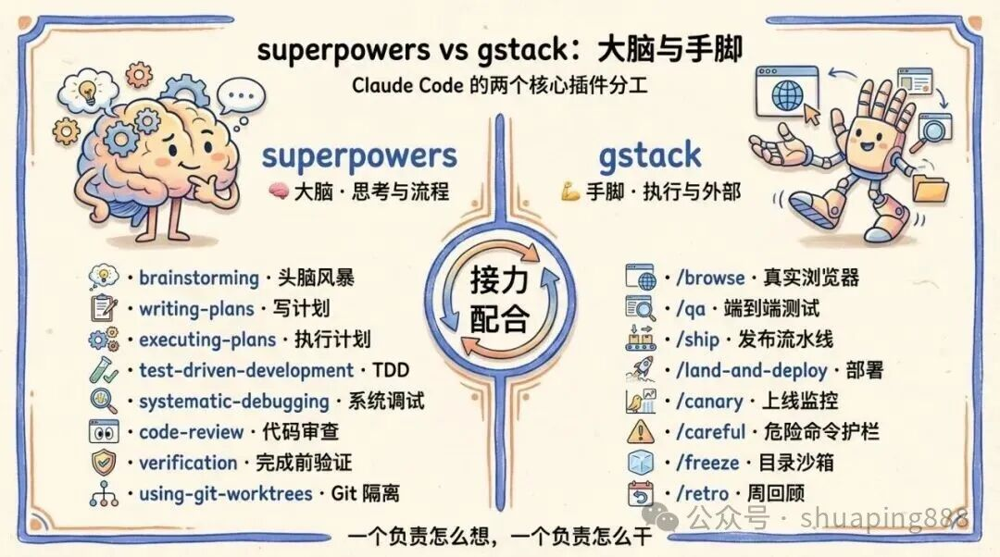
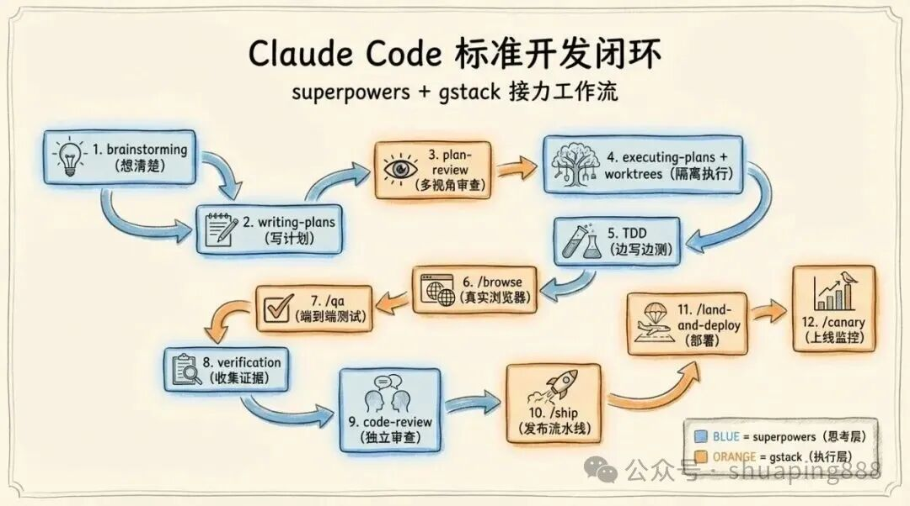
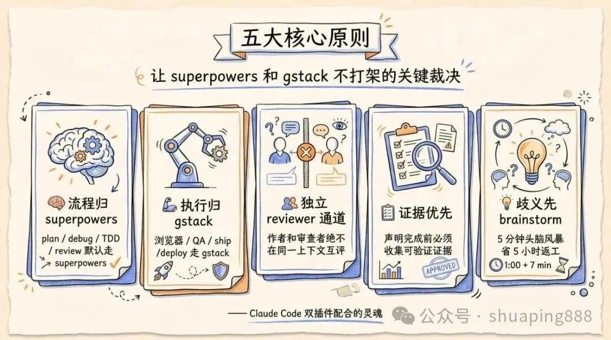

## 一、为什么需要框架融合

Claude Code 生态中 skill/agent/workflow/tool 爆发式增长，带来一个核心矛盾：**单个框架解决局部问题，但真实开发流程是端到端的**。

| 框架 | GitHub Stars | 擅长 | 盲区 |
|------|-------------|------|------|
| Superpowers | 121K+ | 工程方法论、流程纪律 | 浏览器、部署、安全护栏 |
| gstack | 54.6K+ | 真实环境 QA、部署、安全 | 计划撰写、TDD、系统调试 |
| CE（Compound Engineering） | 11.5K+ | 研究型规划、知识复利 | 真实浏览器测试、部署 |
| GSD（Get Stuff Done） | — | 规模分级、状态管理、phase 编排 | 具体执行工具 |

没有一个框架能独立覆盖从想法到上线的全链路。**框架融合不是"装更多插件"，而是设计清晰的职责边界和交接协议**。

本文整理两个来自开源社区的真实融合案例，提取共性模式，为后续自定义编排提供参考。

## 二、案例一：superpowers + gstack 双插件搭配

> 来源：[飞哥 / 刷屏AI — Claude Code 双插件最佳搭配：superpowers 当大脑，gstack 当手脚](https://mp.weixin.qq.com/s/ShJ6ogkcI-6qZtFY--XcTA)
> 完整存档：[[Claude Code双插件最佳搭配：superpowers当大脑，gstack当手脚]]

### 2.1 核心理念

> **superpowers 是大脑，gstack 是手脚。前者教 Claude Code 怎么想，后者让 Claude Code 真的动起来。**

这是最简洁的二分法——把所有能力分成「思考与流程」和「执行与外部世界」两类，分别交给两个插件，互不越界。



### 2.2 关键实践：CLAUDE.md 路由裁决

这个案例最有价值的输出是一份**可直接复用的 CLAUDE.md 配置模板**：

```markdown
# 核心原则
1. 流程归 superpowers：所有 plan、brainstorm、debug、TDD、verify、code review
2. 执行归 gstack：所有浏览器操作、QA 测试、ship、deploy、canary、护栏
3. 独立 reviewer 通道：作者和审查者绝不在同一上下文里互评
4. 证据优先：声明完成前必须收集可验证的证据
5. 遇到歧义先 brainstorm
```

核心洞察：**光安装插件不够，必须用声明式规则消除 skill 匹配的歧义**。Claude Code 遇到"做个计划"这种泛指令时，会按 CLAUDE.md 里的路由表查表执行，而不是随机匹配。

### 2.3 Skill 路由表（精简版）

| 任务类型 | 走 superpowers | 走 gstack |
|---------|---------------|-----------|
| 想清楚做什么 | `brainstorming` | — |
| 写计划 | `writing-plans` | `/plan-*-review`（审查） |
| 写代码 | `test-driven-development` | — |
| 调试 | `systematic-debugging` | `/browse`（看真实页面） |
| QA 验证 | — | `/qa`、`/qa-only` |
| 代码审查 | `requesting-code-review` | — |
| 发布部署 | — | `/ship`、`/land-and-deploy` |
| 上线监控 | — | `/canary`、`/benchmark` |
| 安全护栏 | — | `/careful`、`/freeze`、`/guard` |

### 2.4 标准开发闭环

```
brainstorming → writing-plans → [plan review]
    → executing-plans + worktrees → TDD
    → /browse 或 /qa              ← 交接点：superpowers → gstack
    → verification → code-review
    → finishing-branch → /ship → /land-and-deploy → /canary
```

关键交接点：
- **执行→验证**：代码写完后必须让 gstack 接手做真实浏览器验证
- **自检→他审**：verification 和 code-review 是两个独立 pass，不能合并
- **收尾→发布**：分支收尾归 superpowers，发布流水线归 gstack



## 三、案例二：gstack + Superpowers + CE 三工具对比与组合

> 来源：[十方精舍 — 深入对比 Gstack、Superpowers 和 Compound Engineering（CE）三个最火的 AI Coding 工具](https://mp.weixin.qq.com/s/_hqzV6vGuBf2-95DfQyR2w)
> 完整存档：[[深入对比Gstack、Superpowers和Compound Engineering三个最火的AI Coding工具]]

### 3.1 核心理念：四层职责框架

以 Anthropic「长效智能体」博客为标尺，用**餐厅隐喻**拆解四个核心职责：

| 职责 | 餐厅隐喻 | 最强工具 |
|------|---------|---------|
| 决策（建与否） | 主厨定菜单 | gstack（`/plan-ceo-review`、`/plan-eng-review`） |
| 规划（如何建） | 研究员回顾投诉 | CE（`/ce:plan` 并行研究智能体） |
| 执行（把事做了） | 后厨烹饪 | Superpowers（结构化 SOP）/ CE（`/ce:work`） |
| 评审（建对了吗） | 美食评论家 + 卫生检查员 | CE（动态评审团）+ gstack（`/qa` 真实浏览器） |
| 知识（记住） | 食谱活页夹 | CE（`/ce:compound` 知识复利） |

### 3.2 三个工具的定位差异

- **gstack** = 主厨（决策门控）+ 试吃员（真实浏览器 QA）
  - 强：决策审查、端到端测试、安全护栏、部署
  - 弱：没有"食谱本"，每次从零开始

- **Superpowers** = 后厨流程手册（结构化工作流纪律）
  - 强：`brainstorm → plan → execute → review` 标准 SOP
  - 弱：会话间知识隔离，无法继承上次的教训

- **CE** = 越读越厚的食谱（研究驱动规划 + 知识复利）
  - 强：并行研究智能体、6+ 评审员动态评审团、`/ce:compound` 知识沉淀
  - 弱：无真实浏览器测试、无部署能力

### 3.3 高阶"组合拳"流程

```
1. 澄清需求  → "95% 信心"提示词，让 AI 采访你
2. 决策      → gstack /office-hours + /plan-ceo-review + /plan-eng-review
3. 执行      → CE /ce:brainstorm → /ce:plan → /ce:work → /ce:review
4. 真机测试  → gstack /qa
5. 沉淀知识  → CE /ce:compound
6. 交付      → 下次从第 1 步开始时，规划阶段已拥有所有历史经验
```

### 3.4 CE 知识复利的机制

`/ce:compound` 启动 5 个子智能体：

1. 上下文分析器 → 提取问题类型
2. 解决方案提取器 → 捕获死路、根因、最终修复
3. 相关文档查找器 → 知识库去重
4. 预防策略师 → 制定预防措施
5. 分类器 → 打标签便于检索

产出写入 `docs/solutions/`。下次规划阶段的研究智能体会自动检索这些记录。



## 四、两个案例的共性模式

跨越这两个案例，可以提取出 **5 个框架融合的通用模式**：

### 模式 1：职责单一，绝不越界

两个案例都强调同一件事——每个插件只做自己擅长的事：

| 案例 | 思考层 | 执行层 | 知识层 |
|------|-------|-------|-------|
| 双插件 | superpowers | gstack | （无） |
| 三工具 | Superpowers / CE plan | gstack QA + CE work | CE compound |

**反模式**：让一个工具同时写计划又做 QA，等于让法官自己写起诉书。

### 模式 2：声明式路由裁决

不靠代码解冲突，**在 CLAUDE.md 里写明确规则**：

```
任务 X → 走框架 A
任务 Y → 走框架 B
遇到歧义 → 走 brainstorm
```

这是目前解决多 skill 匹配冲突的**唯一可靠方法**。Claude Code 的 skill 匹配是模糊的，必须用显式规则覆盖默认行为。

### 模式 3：交接点协议

两个案例都有明确的「在这里切换框架」的交接点：

| 交接点 | 从 | 到 | 触发条件 |
|--------|---|----|---------|
| 计划写完 → 审查 | SP writing-plans | gstack /plan-review | 计划产出后 |
| 代码写完 → QA | SP executing / CE work | gstack /browse / /qa | 代码提交后 |
| 自检 → 他审 | SP verification | SP code-review（新上下文） | 证据收集完 |
| 收尾 → 发布 | SP finishing-branch | gstack /ship | 分支合并前 |

交接点必须有**明确的输入/输出契约**，否则框架之间会"断链"。

### 模式 4：渐进式叠加

两个案例都建议：**先跑通一个框架，再叠加第二个**。

- 新手：选 superpowers 或 gstack 单框架
- 中级：superpowers + gstack 双插件
- 高级：三工具组合拳（+ CE 或 + GSD）

同时安装多个未配置路由的框架，结果是 skill 互相打架、行为不可复现。

### 模式 5：独立 reviewer 通道

两个案例都强调：**作者和审查者绝不在同一个上下文里**。

- 案例一：superpowers 的 `requesting-code-review` 新开 reviewer 上下文
- 案例二：CE 的动态评审团由独立角色组成

这不是"代码审查"的实现细节，而是**认知去偏的工程化手段**。

## 五、与 Vibe Coding 系列的关联

这两个外部案例与我们自己的 Vibe Coding 系列形成**三层互补**：

| 层次 | 内容 | 文章 |
|------|------|------|
| 外部视角：双插件 | superpowers + gstack 实操 | 飞哥案例（本文案例一） |
| 外部视角：三工具 | gstack + SP + CE 对比 | 十方精舍案例（本文案例二） |
| 自研分析：三层架构 | GSD + SP + gstack 嵌套设计 | [[Vibe Coding系列08：GSD+Superpowers+gstack三层插件架构——从定位争议到组合实践]] |
| 自研分析：安全维度 | gstack 安全设计的独特性 | 系列08 第四节 |
| 自研分析：CE 定位 | CE 与 Claude Memory 重叠 | 系列08 第六节 + [[Vibe Coding系列07：Coding Agent时代的代码复用——从架构约束到Plugin协作的实践指南]] |
| 自研基础：框架选型 | GSD/SpecKit/OpenSpec/SP | [[Vibe Coding系列04：流程框架选择指南——GSD、SpecKit、OpenSpec与Superpowers的组合实践]] |

关键差异：
- 外部案例聚焦 **"哪些框架搭配用"**
- 系列08 聚焦 **"为什么这样嵌套 + 冲突怎么解"**
- 系列04 聚焦 **"先选哪个框架"**

三者组合起来，才是完整的框架融合知识体系。

## 六、未来探索方向：从"使用框架"到"编排框架"

### 6.1 核心问题

当前所有案例都是**使用**已有框架的组合。下一步真正的挑战是：

> **怎么最大限度地利用已有的 skill/agent/workflow/tool，在它们的基础上修改、二次编排，变成适合自己团队的定制方案？**

### 6.2 探索路径

**路径 A：CLAUDE.md 路由定制**（最低成本）

- 从飞哥的模板出发，根据自己的技术栈修改路由规则
- 加入项目特定约束（如"所有 Python 项目强制走 Ruff lint"）
- 适合：个人开发者、小团队

**路径 B：自定义 Skill 封装**（中等成本）

- 把常用的多步操作封装为自定义 skill
- 在 skill 内部编排调用不同框架的命令
- 例如：`/my-review` = superpowers verification + gstack /qa + CE /ce:review
- 适合：有固定流程的团队

**路径 C：Phase + Skill Runtime 编排**（高成本，高回报）

- 用 GSD 的 phase 机制做外层状态管理
- 每个 phase 内部调用不同框架的 skill
- 参考 [[Vibe Coding系列05：大项目落地困局——从Context爆炸到Skill Runtime的范式迁移]] 的 Skill Runtime 思路
- 适合：大型项目、多人协作

**路径 D：团队级知识复利**（CE 启发）

- CE 的 `docs/solutions/` 是项目级的
- 扩展为团队级：跨项目共享 solutions 库
- 与 Claude Code Memory 结合，做持久化知识管理
- 这是 CE 最值得深入的方向，但需注意与 Claude Memory 的去重

### 6.3 自定义编排的评估框架

在决定"要不要自定义"之前，先问四个问题：

| 问题 | 如果 YES | 如果 NO |
|------|---------|---------|
| 现有框架的默认路由是否经常匹配错？ | 先写 CLAUDE.md 路由规则 | 保持现状 |
| 是否有 3+ 个步骤总是连续执行？ | 封装为自定义 skill | 手动串联即可 |
| 团队是否有 2+ 人共用同一套流程？ | 写 team-level CLAUDE.md | 个人配置足够 |
| 项目是否跨越 5+ 个 phase？ | 用 GSD phase 编排 | skill 级别够用 |

**原则：能用 CLAUDE.md 解决的不写 skill，能用 skill 解决的不写 phase 编排。复杂度应该是被需求逼出来的，不是预先设计出来的。**

## 七、总结

两个外部案例给出了同一个信号：**框架融合已经从"要不要做"变成了"怎么做好"**。

核心收获：

1. **职责单一**——每个框架只做一件事，用 CLAUDE.md 裁决边界
2. **交接协议**——框架之间的切换点必须有明确的输入/输出契约
3. **渐进叠加**——先一个，再两个，别一次全装
4. **知识沉淀**——CE 的 compound 机制值得借鉴，但要注意与 Claude Memory 去重
5. **二次编排是下一步**——从使用框架到编排框架，是从"用工具的人"到"造工具的人"的跃迁

---

## 参考来源

- [Claude Code 双插件最佳搭配：superpowers 当大脑，gstack 当手脚](https://mp.weixin.qq.com/s/ShJ6ogkcI-6qZtFY--XcTA)（飞哥 / 刷屏AI）
- [深入对比 Gstack、Superpowers 和 Compound Engineering（CE）三个最火的 AI Coding 工具](https://mp.weixin.qq.com/s/_hqzV6vGuBf2-95DfQyR2w)（十方精舍）

## 相关文章

- [[Vibe Coding系列08：GSD+Superpowers+gstack三层插件架构——从定位争议到组合实践]] — 三层嵌套架构设计与冲突解决
- [[Vibe Coding系列07：Coding Agent时代的代码复用——从架构约束到Plugin协作的实践指南]] — 四层防线体系与 CE 知识复利分析
- [[Vibe Coding系列05：大项目落地困局——从Context爆炸到Skill Runtime的范式迁移]] — Skill Runtime 编排思路
- [[Vibe Coding系列04：流程框架选择指南——GSD、SpecKit、OpenSpec与Superpowers的组合实践]] — 框架选型全景
- [[Claude Code双插件最佳搭配：superpowers当大脑，gstack当手脚]] — 案例一完整存档
- [[深入对比Gstack、Superpowers和Compound Engineering三个最火的AI Coding工具]] — 案例二完整存档
