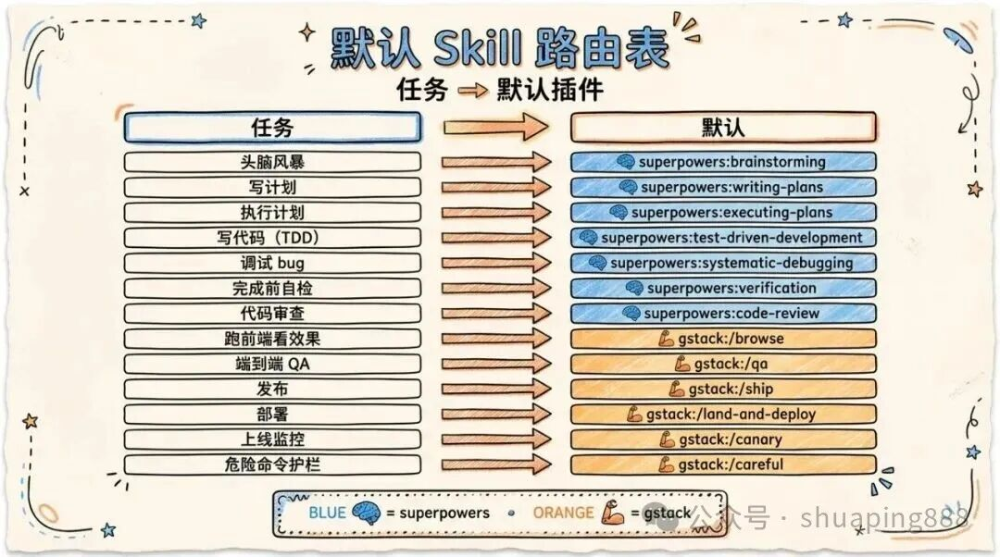
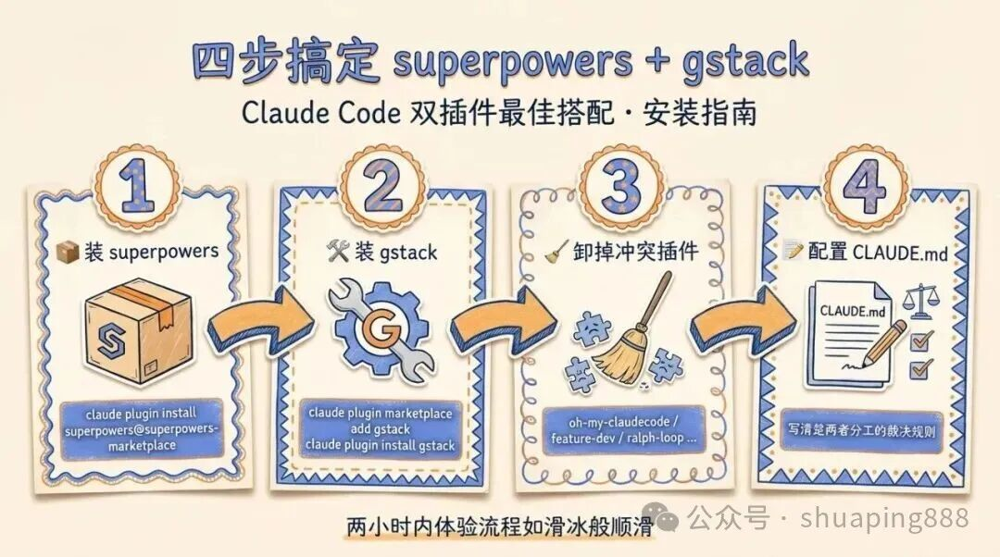

# Claude Code 双插件最佳搭配：superpowers 当大脑，gstack 当手脚

> 原文来源：[飞哥 / 刷屏AI](https://mp.weixin.qq.com/s/ShJ6ogkcI-6qZtFY--XcTA)
>
> 本文作为外部最佳实践案例存档，展示了通过 Claude Code 融合 superpowers + gstack 两个框架的完整实践。与 [[Vibe Coding系列08：GSD+Superpowers+gstack三层插件架构——从定位争议到组合实践]] 形成互补参考。

---

> 一个负责怎么想，一个负责怎么干。两个插件一组合，Claude Code 才算真正变成"工程师"。


如果你也在用 Claude Code，大概率装过一堆插件：oh-my-claudecode、feature-dev、code-review、ralph-loop、document-skills……装着装着就发现一个尴尬的事实——**它们的功能严重重叠**。

写计划有四五个 skill 在抢，做代码审查有三个版本，调试模式两套并行。结果就是每次 Claude Code 启动时随机匹配一个 skill，行为完全不可复现。

折腾了一段时间之后，我把插件砍到只剩两个核心：**superpowers** 和 **gstack**。一个管"思考与流程"，一个管"执行与外部世界"。**没有重叠，没有冲突，分工清晰得像教科书**。

## 一、为什么是这两个：大脑和手脚

先说一个核心观察：**一个真正能干活的 AI 工程师，需要两种截然不同的能力**。

第一种是"想清楚"的能力：拿到需求要会拆解，写代码前要会规划，遇到 bug 要会系统化排查，写完代码要会自检和审查。这是流程层、方法论层。

第二种是"动得了"的能力：要能真的打开浏览器看页面有没有渲染对，要能跑端到端测试验证功能，要能 ship 到生产环境，要能在上线后监控有没有出错。这是执行层、外部世界层。

> **superpowers 是大脑，gstack 是手脚**。前者教 Claude Code 怎么想，后者让 Claude Code 真的动起来。

把这两件事分给两个不同的插件做有个巨大的好处：**没有功能重叠，没有 skill 抢匹配**。superpowers 不碰浏览器，gstack 不抢计划撰写，两者井水不犯河水，配合起来异常顺滑。

## 二、superpowers 是什么：一套完整的工程方法论

**superpowers** 是 Jesse Vincent 团队做的一套 skill 集合，本质上是把"高质量软件工程的工作流"编码成 Claude Code 能直接执行的 skill。它的核心理念只有一句话：**把人类工程师做事的方式，变成 AI 能严格遵守的流程**。

具体它管哪些事？

**计划与思考层**：

- `brainstorming` —— 任何创造性工作开始前的强制头脑风暴
- `writing-plans` —— 把模糊需求变成可执行的实施计划
- `executing-plans` —— 严格按计划执行，带 review checkpoint

**编码与调试层**：

- `test-driven-development` —— 强制 TDD，先写测试再写实现
- `systematic-debugging` —— 系统化调试方法论，禁止瞎猜
- `using-git-worktrees` —— 用 worktree 隔离工作，不污染主分支
- `dispatching-parallel-agents` —— 并行子代理调度

**审查与验证层**：

- `verification-before-completion` —— 声明完成前必须收集证据
- `requesting-code-review` —— 请求独立 reviewer
- `receiving-code-review` —— 接收审查意见的标准流程
- `finishing-a-development-branch` —— 分支收尾的完整 checklist

最关键的一条理念是：**作者和审查者绝不在同一个上下文里互评**。Claude 在写完代码后不能立刻自我审查，必须新开一个 reviewer 通道——因为同一个上下文里 Claude 已经"代入"了作者视角，自己审查自己只会找到自己想找的问题。



## 三、gstack 是什么：让 Claude Code 真的能动手

如果说 superpowers 是方法论，那 **gstack** 就是工具箱。它解决的是 superpowers 完全不碰的问题：**怎么和真实的外部世界打交道**。

gstack 的核心能力可以分成四块：

**浏览器与 QA**：

- `/browse` —— 真实的 headless Chromium，可以打开任何 URL、点按钮、看 DOM、截图。这是 Claude Code 看见前端世界的唯一靠谱方式
- `/qa` —— 端到端 QA 测试，自动跑应用、发现 bug、修 bug、再跑一遍
- `/qa-only` —— 只测试不修复，输出结构化报告
- `/qa-design-review` —— 从设计师视角做 QA，找视觉一致性问题

**Ship 与 Deploy**：

- `/ship` —— 完整的发布流水线：跑测试 → review diff → bump 版本 → 更新 changelog → commit → push → 创建 PR
- `/land-and-deploy` —— 合 PR、等 CI、等部署、验证生产环境
- `/setup-deploy` —— 自动检测 Fly.io / Render / Vercel / Netlify 等平台并配置

**上线后监控**：

- `/canary` —— 上线后观察生产环境的控制台错误、性能回归、页面失败
- `/benchmark` —— 性能基线建立和回归检测，盯着 Core Web Vitals

**安全护栏**：

- `/careful` —— 拦截危险命令（`rm -rf`、`DROP TABLE`、`force-push`、`git reset --hard`）
- `/freeze` —— 把可编辑范围限定在某个目录，调试敏感代码时用
- `/guard` —— `/careful` + `/freeze` 的组合拳

**多视角 plan review**：

- `/plan-ceo-review` —— CEO 视角的产品 review，会挑战范围和优先级
- `/plan-eng-review` —— 工程 manager 视角，盯架构、数据流、边界 case
- `/plan-design-review` —— 设计师视角，盯视觉一致性和交互细节



## 四、安装：两条命令搞定

**第一步：安装 superpowers**

```bash
claude plugin install superpowers@superpowers-marketplace
claude plugin install superpowers-chrome@superpowers-marketplace
claude plugin install superpowers-lab@superpowers-marketplace
claude plugin install superpowers-developing-for-claude-code@superpowers-marketplace
```

四个包是 superpowers 的完整套装。`superpowers` 是核心方法论，`superpowers-chrome` 是底层 CDP 浏览器控制（gstack 不够用时的兜底），`superpowers-lab` 是 Slack/Windows VM/tmux 等实验工具，`superpowers-developing-for-claude-code` 是写 Claude Code 插件本身用的工具。

**第二步：安装 gstack**

```bash
claude plugin marketplace add gstack
claude plugin install gstack
```

**第三步：清掉冲突的旧插件（如果有）**

```bash
claude plugin uninstall oh-my-claudecode@omc
claude plugin uninstall feature-dev@claude-plugins-official
claude plugin uninstall code-review@claude-plugins-official
claude plugin uninstall ralph-loop@claude-plugins-official
claude plugin uninstall ralph-wiggum@claude-code-plugins
claude plugin uninstall document-skills@skills
```

**第四步：配置 CLAUDE.md**

这是最关键的一步。光装好插件不够，还得在 `~/.claude/CLAUDE.md` 里写清楚两者的分工裁决，否则 Claude Code 还是会乱匹配。

## 五、核心配置：CLAUDE.md 模板

把下面这段直接放进 `~/.claude/CLAUDE.md`：

```markdown
# Claude Code 配置：superpowers + gstack

主干由两个插件组成：
- superpowers —— 思考与流程层（plan/brainstorm/debug/TDD/review/verify）
- gstack —— 执行与外部世界层（browser/QA/ship/deploy/canary/护栏）

类比：superpowers 是大脑，gstack 是手脚。

## 核心原则

1. 流程归 superpowers：所有 plan、brainstorm、debug、TDD、verify、code review 默认走 superpowers。
2. 执行归 gstack：所有浏览器操作、QA 测试、ship、deploy、canary、retro 走 gstack。
3. 独立 reviewer 通道：作者和审查者绝不在同一上下文里互评。
4. 证据优先：声明完成前必须收集可验证的证据。
5. 遇到歧义先 brainstorm。

## 浏览器规则

/browse 是唯一的浏览器入口。禁止使用 mcp__claude-in-chrome__* 和 mcp__computer-use__* 来操作浏览器。

## 不要重复造轮子

下列能力只走 superpowers：
- plan / brainstorm / writing-plans / executing-plans
- TDD / debugging / verification
- code review（请求和接收）
- subagent / parallel dispatch
- worktrees

下列能力只走 gstack：
- 浏览器、QA、ship、deploy、canary、retro、护栏
```

这段配置的核心作用是**把模糊的 skill 匹配规则变成明确的裁决**。Claude Code 在遇到"做个计划"这种泛指令时，会按这个表查表执行，而不是随机匹配。

## 六、默认 skill 路由表

下面这张表是日常工作的"地图"。任何任务先查表，知道默认走哪个 skill。

| 任务 | 默认 skill | 备选/补强 |
|------|-----------|----------|
| 想清楚要做什么 | `superpowers:brainstorming` | — |
| 写实施计划 | `superpowers:writing-plans` | 多视角审查 → `gstack:/plan-*-review` |
| 执行计划 | `superpowers:executing-plans` + worktrees | 并行 → `dispatching-parallel-agents` |
| 写代码 | `superpowers:test-driven-development` | — |
| 调试 bug | `superpowers:systematic-debugging` | 看真实页面 → `gstack:/browse` |
| 跑前端看效果 | `gstack:/browse` | — |
| 端到端 QA（带修 bug） | `gstack:/qa` | — |
| 完成前自检 | `superpowers:verification-before-completion` | — |
| 请求代码审查 | `superpowers:requesting-code-review` | 二次意见 → `gstack:/review` |
| 收尾分支 | `superpowers:finishing-a-development-branch` | — |
| Ship 发布 | `gstack:/ship` → `/land-and-deploy` | — |
| 上线后监控 | `gstack:/canary` / `/benchmark` | — |
| 写发布文档 | `gstack:/document-release` | — |
| 周回顾 | `gstack:/retro` | — |
| 危险命令护栏 | `gstack:/careful` 或 `/guard` | — |

> 这张表的本质是**把模糊的"做某事"映射到确定的 skill**。表里没有的任务才需要现场判断。

## 七、标准开发闭环：一条龙走完

从一个想法到上线的标准路径：

```
[想法]
  ↓
brainstorming              ← 想清楚要不要做、做成什么样
  ↓
writing-plans              ← 写一份可执行的实施计划
  ↓
(可选) /plan-eng-review    ← 多视角审查计划
  ↓
executing-plans + worktrees ← 在隔离 worktree 里执行
  ↓
test-driven-development    ← 边写边测
  ↓
/browse 或 /qa             ← 真实环境验证功能
  ↓
verification-before-completion ← 收集完成证据
  ↓
requesting-code-review     ← 独立 reviewer 通道
  ↓
finishing-a-development-branch ← 分支收尾
  ↓
/ship                      ← 跑测试、bump 版本、push、PR
  ↓
/land-and-deploy           ← 合 PR、等 CI、等部署
  ↓
/canary                    ← 监控上线后状态
  ↓
/document-release          ← 写发布文档
  ↓
[完成]
```

关键交接点：

**交接点 1：writing-plans → executing-plans**。计划写完不会自动开干，需要显式执行。中间可以插入 plan review。

**交接点 2：executing-plans → /browse 或 /qa**。代码写完了，下一步**必须**用真实浏览器或 QA 验证。superpowers 自己不会跑浏览器，这里必须让 gstack 接手。

**交接点 3：verification → requesting-code-review**。自检和他人审查是两个独立的 pass，**不能合并**。verification 是作者自己确认证据齐全，code-review 是另开一个 reviewer 上下文做独立判断。

**交接点 4：finishing-a-development-branch → /ship**。分支收尾归 superpowers，发布流水线归 gstack。这两个 skill 之间是平滑衔接的。

> 整个闭环最大的特点是：**superpowers 和 gstack 像接力赛一样交替工作**，谁也不会越界做对方的事。


## 八、核心原则的背后逻辑

**原则 1：流程归 superpowers**

为什么不能让 gstack 也做计划？因为 gstack 的 plan-\*-review 是"批判性审查"工具，不是计划撰写工具。让一个 reviewer 同时充当 author，等于让法官自己写起诉书——视角错位，质量必差。

**原则 2：执行归 gstack**

为什么不能让 superpowers 自己跑浏览器？因为 superpowers 的 chrome 子包用的是底层 CDP，操作粒度太细，没有 QA 闭环。gstack 的 /browse 和 /qa 是经过封装的高层操作，包含了"打开 → 验证 → 截图 → 报告"完整链路。**用对工具比用上工具更重要**。

**原则 3：独立 reviewer 通道**

这条最反直觉，但最重要。Claude 在写完一段代码后立刻被要求审查，会下意识维护自己的工作——找到的问题会偏向"无关紧要的小瑕疵"，而真正的设计缺陷会被自动忽略。**新开一个 reviewer 上下文相当于换一个人**，这个人没有"我刚写了这段代码"的心理负担，找问题的视角完全不同。

**原则 4：证据优先**

不要相信 Claude 说"这个功能已经实现完毕"。要看：测试有没有通过？/browse 有没有截图证明页面正常？/qa 报告里有没有红色警告？**没有证据的完成 = 没完成**。verification-before-completion 这个 skill 就是强制把这条变成肌肉记忆。

**原则 5：遇到歧义先 brainstorm**

这条是性价比最高的一条。很多时候用户的需求里有 30% 的隐含假设，直接开干等于赌博。花 5 分钟 brainstorming 把假设全部摊开来确认，能省后面 5 小时的返工。


## 九、实战示例：从需求到上线

假设用户说："给我们的官网加一个深色模式切换。"

**第 1 步：brainstorming**——启动 `superpowers:brainstorming`，问几个关键问题：是只切根色板还是要逐元素调？要不要持久化用户偏好？跟系统主题怎么联动？

**第 2 步：writing-plans**——把答案变成一份实施计划：先加 CSS variables → 再加 ThemeProvider → 再加 toggle 组件 → 再做持久化 → 最后 e2e 测试。每一步都标注可验证的产物。

**第 3 步：plan-design-review（可选但推荐）**——调用 `gstack:/plan-design-review` 让设计师视角审查一下：颜色对比度够不够？切换动画是否突兀？暗色下的图片处理怎么办？

**第 4 步：executing-plans + TDD**——在新 worktree 里执行计划，每个改动都先写测试。

**第 5 步：/browse 验证**——调用 `gstack:/browse` 打开本地开发服务器，手动切换主题、看每个页面的渲染、截图存档。

**第 6 步：/qa 跑端到端**——用 `gstack:/qa` 跑一遍主流程，确认深色模式不破坏现有功能。

**第 7 步：verification-before-completion**——收集所有证据：测试报告、截图、QA 报告。Claude 要在这一步明确说"我有 X 个证据证明完成"，而不是"我觉得应该完成了"。

**第 8 步：requesting-code-review**——新开一个 reviewer 上下文做独立审查。这一步经常会发现 author 视角看不见的问题。

**第 9 步：/ship → /land-and-deploy → /canary**——跑发布流水线、合 PR、等部署、监控上线后是否有控制台报错。

整个流程**两个插件无缝交替**，每一步都有明确的产物和交接点。

## 十、总结

> 大脑负责想清楚，手脚负责干漂亮。Claude Code 也一样。

插件不在多，在配合。superpowers 和 gstack 这套搭配的本质，就是**把"思考"和"执行"彻底分开**——一个负责想，一个负责干，谁也不抢谁的活。

这种"职责单一"的设计哲学不只适用于 Claude Code。任何复杂系统的最优配置都遵循同一个原则：**更少的组件，更清晰的边界，更明确的交接**。

---

## 相关文章

- [[Vibe Coding系列08：GSD+Superpowers+gstack三层插件架构——从定位争议到组合实践]] — 在 superpowers + gstack 基础上再加 GSD 外层的三层架构设计
- [[Vibe Coding系列04：流程框架选择指南——GSD、SpecKit、OpenSpec与Superpowers的组合实践]] — 流程框架选择的全景对比
- [[Claude Code的Agent与Subagent架构解析——以Superpowers为例]] — superpowers 内部的 Agent/Subagent 架构分析
- [[Coding Agent Plugin生态调研——协议、最佳实践与自定义plugin开发]] — 更广泛的 Coding Agent 插件生态调研
