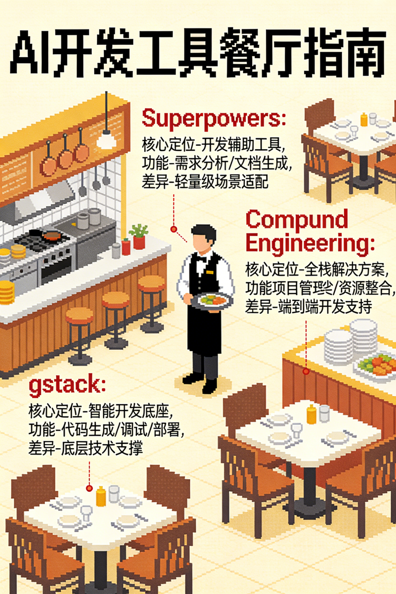

# 深入对比 Gstack、Superpowers 和 Compound Engineering（CE）三个最火的 AI Coding 工具

> 原文来源：[十方精舍](https://mp.weixin.qq.com/s/_hqzV6vGuBf2-95DfQyR2w)
>
> 本文作为外部参考案例存档，从 Anthropic「长效智能体」博客的四层职责框架出发，对比 gstack、Superpowers、CE 三个工具的定位差异，并给出组合使用的最佳实践。与 [[Vibe Coding系列08：GSD+Superpowers+gstack三层插件架构——从定位争议到组合实践]] 和 [[Claude Code双插件最佳搭配：superpowers当大脑，gstack当手脚]] 形成互补视角。

---

最近，Claude Code 圈子里有三个工具火得一塌糊涂：Garry Tan 的 **gstack**（54.6K ⭐）、Jesse Vincent 的 **Superpowers**（121K ⭐），以及 Every Inc 的 **Compound Engineering**（CE，11.5K ⭐）。

深入对比了这三个仓库后，我发现了一个被大多数人忽视的真相：**这根本不是三个竞争对手，而是三个不同层面的工具，它们的"重心"截然不同。** 大多数人装了一个就以为全覆盖了，其实可能只解决了问题的一角。

为了讲清楚这三者的区别，我们可以用 **Anthropic 在 2025 年 11 月发布的工程博客** 作为标尺。这篇博客提出了"长效智能体"的架构设计，我将其扩展为四个核心职责，并用一个**餐厅隐喻**来拆解：

1. **主厨定菜单**：决定做什么菜（规划 Planning）。
2. **后厨团队烹饪**：把菜做出来（执行 Execution）。
3. **独立试吃员**：检查菜好不好吃（评估 Evaluation）。厨师不能自己给自己打分。
4. **交接笔记**：传给下一班次的经验（跨会话状态 Cross-session state）。

## 一、gstack：主厨与试吃员

**核心定位：决策门控与真实世界 QA**

gstack 在"规划"和"评估"这两个环节表现最强，它就像是餐厅里的**主厨**和**试吃员**。

### 1. 决策门控

gstack 提供了两个核心命令，作为项目启动前的必经关卡：

- **`/plan-ceo-review`**：从产品角度拷问你，"这东西值得做吗？"
- **`/plan-eng-review`**：从架构角度审视你，"这样写以后会不会炸？"

这两个"门控"必须全部通过，代码才能动工。这避免了开发者（尤其是独立开发者）闷头写代码最后却发现做错了方向的悲剧。

> **实用技巧**：
> 在运行 `/office-hours` 之前，试着用这个 Prompt 让 AI 采访你：
> *"我要开始这个项目了。请采访我，直到你有 95% 的信心确认我真正想要什么，而不是我以为我想要什么。"*
>
> 让 AI 问你问题，比你给 AI 下指令有效 10 倍。大多数项目失败不是因为代码写错了，而是因为没人理清需求。

### 2. 真实用户测试

这是 gstack 的杀手锏。它的 `/qa` 命令不是看代码有没有语法错误，而是**打开真实的浏览器，像真人一样点击你的网站**。Anthropic 的测试表明，依赖代码层面的检查远远不如端到端的浏览器测试有效。Garry Tan 声称用这套配置在 60 天内交付了 60 万行生产代码（日均 1-2 万行），核心就在于此。

**局限**：gstack 就像一个拥有顶级大厨和试吃员的餐厅，但**没有"食谱本"**。没人记录今晚做砸了什么，明天的团队从头开始，可能会踩同样的坑。

## 二、Superpowers：后厨流程手册

**核心定位：结构化工作流纪律**

Superpowers 拥有 12 万+ 的星标，证明了它的价值。它把开发者从"随机和 AI 聊天"升级为"有流程地使用 AI"。

它的核心流程是：`brainstorm → plan → execute → review`。

这就像从大家各自发挥的野路子厨房，变成了拥有标准作业程序（SOP）的后厨。它引入了子智能体驱动的开发模式，有独立的规范评审和代码质量评审。

**局限**：Superpowers 极大地改善了单次会话的流程，但**会话间的知识是隔离的**。每一次新会话都从零开始，无法继承上一次的教训。

## 三、Compound Engineering（CE）：那本越读越厚的食谱

**核心定位：研究驱动规划与知识复利**

CE 的流程是：`brainstorm → plan → work → review → compound`。

前四步看似与 Superpowers 相似，但深度完全不同。

### 1. 规划阶段：研究型智能体

普通的规划是在当前对话里写个计划，而 CE 的 `/ce:plan` 会**并行启动研究智能体**，挖掘项目历史、扫描代码库模式、读取 Git 提交日志。

这就像新来的厨师在设计明天的菜单前，先读遍了过去三个月所有的"退菜投诉单"，而不是凭空瞎猜。

### 2. 评审阶段：动态评审团

CE 的 `/ce:review` 不是一个人在评审。它运行一个**动态评审团**，至少包含 6 个常驻评审员：正确性、安全性、性能、测试、可维护性、对抗性。根据代码变更的复杂度，还可能增加更多。

这就像让美食评论家、卫生检查员和顾客小组同时品尝一道菜，各自出具独立报告。

### 3. 核心创新：知识复利

这是 CE 名字的由来，也是它与其他工具的分水岭。

完成任务后，运行 `/ce:compound`，它会启动 5 个子智能体：

1. **上下文分析器**：追踪对话，提取问题类型。
2. **解决方案提取器**：捕获哪些路不通、根本原因和最终修复。
3. **相关文档查找器**：搜索知识库去重。
4. **预防策略师**：制定未来如何预防此类问题。
5. **分类器**：打标签以便检索。

最终，这些内容会合并写入 `docs/solutions/` 目录。

**通俗解释**：你的 Agent 在每次下班前都会写一份"结业总结"。下次任何 Agent 开始新任务时，会先读一遍所有总结。比如你修复了一个边缘运行时兼容性 Bug，调试了几个小时。Compound 会自动记录：问题、症状、踩过的坑、最终方案、预防措施。三周后，类似问题再次出现，规划阶段的"研究员"会自动找到这条记录："我们以前踩过这个坑，解法在这里。" 几小时的调试压缩成几分钟。

**关键区别**：Anthropic 博客里的进度文件是"今晚留给早班的交接条"（线性，单次传递）；CE 的 `docs/solutions/` 是"每个员工入职第一天和之后每天都要读的食谱活页夹"（可检索，指数级积累）。前者解决连续性，后者解决积累性。一个是线性的，一个是指数级的。

## 四、总结与组合建议

这三个工具各有重心，并非互斥。

| 层级 | 对应工具 | 餐厅比喻 |
|------|---------|---------|
| **决策（建与否）** | gstack | 主厨设定菜单 |
| **规划（如何建）** | CE `/ce:plan` | 研究员回顾过往投诉 |
| **执行** | CE `/ce:work` | 厨房团队烹饪 |
| **评审（建对了吗）** | CE `/ce:review` + gstack `/qa` | 美食评论家 + 卫生检查员 |
| **知识（记住）** | CE `/ce:compound` | 每个人都会阅读的食谱活页夹 |

### 给新手的建议

先选一个主框架（gstack 或 CE）熟悉流程。同时安装多个可能会导致流程冲突和命令重叠。先跑通一个，再叠加。

### 给高阶玩家的"组合拳"流程

1. **澄清需求**：使用"95% 信心"提示词，让 AI 采访你。
2. **决策**：运行 gstack 的 `/office-hours`、`/plan-ceo-review`、`/plan-eng-review`，确保"做正确的事"。
3. **执行**：运行 CE 的 `/ce:brainstorm` → `/ce:plan` → `/ce:work` → `/ce:review`，确保"把事做对"。
4. **真机测试**：运行 gstack 的 `/qa`，在真实浏览器里跑一遍。
5. **沉淀知识**：运行 CE 的 `/ce:compound`，记录经验教训。
6. **交付**。下次从第 1 步开始时，你的规划阶段已经拥有了上次所有的经验。

## 五、思考与延伸

### 1. "知识复利"是 AI 编程工具的下半场

目前国内主流的 AI 编程助手大多聚焦于"单点代码生成"或"单次对话辅助"。这就像 Superpowers 之前的阶段——虽然提高了写代码的速度，但**无法沉淀项目级的隐性知识**。

CE 的 `/ce:compound` 机制非常值得借鉴。在企业级落地中，如果能将 `docs/solutions/` 沉淀为团队共享的知识库，解决"新人重复踩坑"的痛点，其价值远超代码生成本身。这可能是 ToB AI 编程工具的一个差异化方向。

### 2. "评审团模式"对抗大模型幻觉

文中提到的"动态评审团"设计（安全性、性能、对抗性等独立角色）非常符合工程化落地的需求。在实际项目中，单一的大模型往往难以兼顾所有维度，容易出现"代码能跑但不安全"的情况。

引入这种多智能体互相"挑刺"的机制，或许是 AI 代码准入生产环境的一道必要防线。

### 3. 上下文窗口 vs 外部状态管理

虽然 Claude Opus 4.6 已经有了 100 万 token 的上下文窗口，但 Anthropic 官方依然强调外部状态文件的重要性。这对开发者是个提醒：不要迷信"把整个代码库塞进 Prompt"。

对于长期维护的项目，**结构化的外部记忆（如 CE 的方案）比单纯的长上下文更可靠**。它不仅降低了成本，更重要的是提供了可解释、可检索的知识沉淀，这才是"长效智能体"的正确打开方式。

---

## 相关文章

- [[Vibe Coding系列08：GSD+Superpowers+gstack三层插件架构——从定位争议到组合实践]] — 在两层基础上加 GSD 外层的三层架构设计，含 CE 正交分析
- [[Claude Code双插件最佳搭配：superpowers当大脑，gstack当手脚]] — superpowers + gstack 双插件搭配的具体实操
- [[Vibe Coding系列07：Coding Agent时代的代码复用——从架构约束到Plugin协作的实践指南]] — CE 知识复利与 Claude Code Memory 的重叠分析
- [[Vibe Coding系列04：流程框架选择指南——GSD、SpecKit、OpenSpec与Superpowers的组合实践]] — 更多流程框架的选择与组合
