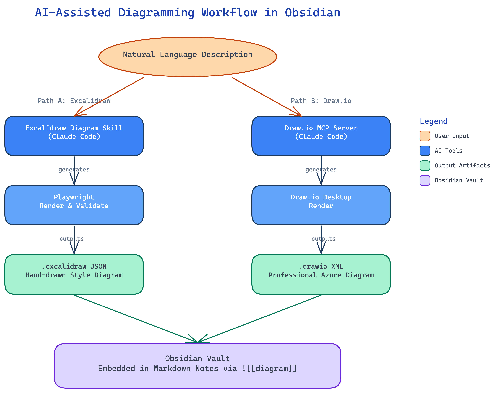
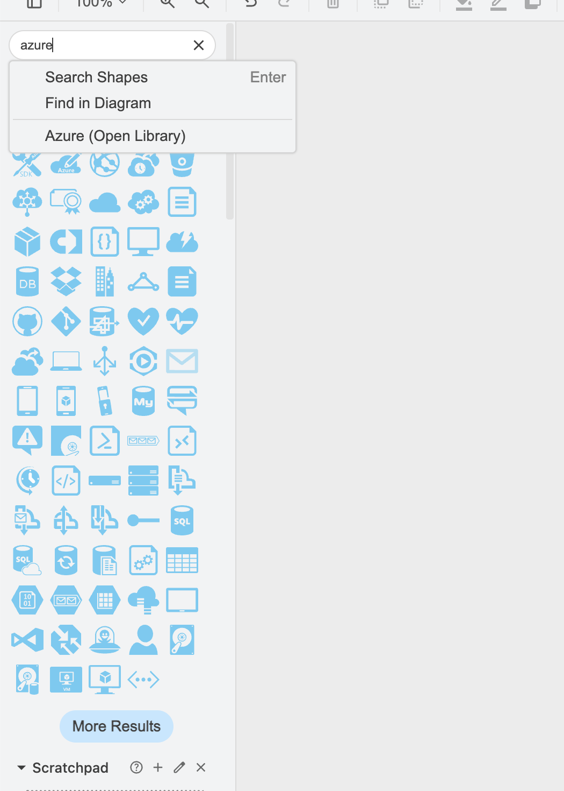
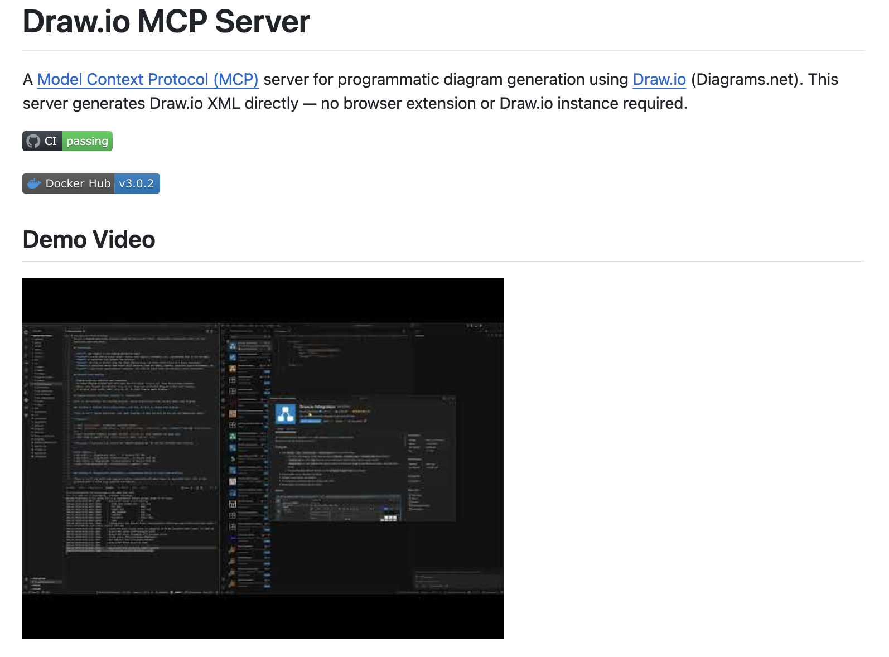

# 在 Obsidian 中用 Excalidraw 与 Draw.io 绘制 Azure 架构图实战指南

Obsidian 是一个以 Markdown 为核心的知识管理工具，但纯文字难以表达复杂的系统架构。本文对比 **Excalidraw**（手绘草图风）和 **Draw.io**（专业工程风）两种绘图工具，梳理它们在 Obsidian 中的集成方式、AI 辅助方案，以及各自适用的场景。

核心思路：**先用 Excalidraw 快速构思草图，再用 Draw.io 出正式架构图**，两者互补。

---

## 一、Excalidraw — 随意手绘风格

### 1.1 Obsidian Excalidraw 插件

[obsidian-excalidraw-plugin](https://github.com/zsviczian/obsidian-excalidraw-plugin)（zsviczian/obsidian-excalidraw-plugin）是 Obsidian 中最受欢迎的绘图插件，可以在 vault 中直接创建和编辑 `.excalidraw` 文件。

**核心特点**：

- **手绘风格**：独特的手绘笔触，适合非正式的概念表达
- **Markdown 存储**：`.excalidraw` 文件本质上是 markdown 文件，与 Obsidian 链接系统完全兼容
- **自由画布**：无限画布，支持 LaTeX 公式、嵌入 markdown 内容、自定义字体和笔触
- **自动导出**：支持自动导出为 PNG/SVG，方便在其他地方使用
- **图标库**：通过 [Excalidraw Libraries](https://libraries.excalidraw.com) 导入社区图标库
- **Script Engine**：支持自动化宏，可编程扩展

**在笔记中嵌入**：

```markdown
![[diagram.excalidraw]]
```

**适合场景**：头脑风暴、概念图、流程草图、白板协作、快速原型。

### 1.2 Excalidraw + AI（Excalidraw Diagram Skill）

[excalidraw-diagram-skill](https://github.com/coleam00/excalidraw-diagram-skill) 是一个 Claude Code Skill，用自然语言描述即可自动生成 Excalidraw 图形。

**安装方式**：

```bash
# 克隆到 Claude Code skills 目录
git clone https://github.com/coleam00/excalidraw-diagram-skill.git .claude/skills/excalidraw-diagram
```

**依赖**：需要 `uv` 和 Playwright（用于渲染验证）。

**工作原理**：自然语言描述 -> 自动生成 Excalidraw JSON -> Playwright 渲染为 PNG -> 验证布局。

**特点**：

- **视觉论证**：用形状映射概念关系
- **证据驱动**：嵌入代码片段而非占位符
- **内置验证**：自动渲染检查布局正确性
- **可自定义品牌配色**

**适合场景**：快速用自然语言生成概念图、系统架构草图。

**实际生成效果**（使用 Excalidraw Diagram Skill 自动生成的 AI 辅助绘图工作流图）：



---

## 二、Draw.io — 专业 Azure 架构图

### 2.1 Draw.io 桌面版

Draw.io 桌面版是绘制正式 Azure 架构图的首选工具。其最大优势是**内置 700+ 官方 Microsoft Azure 架构图标**。



**启用 Azure 图标库**：在 Draw.io 中搜索 "azure" 即可打开 Azure (Open Library)，包含约 20 个类别：

- Networking、Compute、Storage、Database、Integration
- AI + Machine Learning、Security、DevOps、IoT 等

**最佳实践**：

1. **Region 框**：用矩形框表示 Azure Region，设为虚线边框或彩色背景
2. **层次组织**：概览图 -> 高层架构图（服务/资源组/VNet）-> 低层实现图
3. **Scratchpad 复用**：保存常用子组件到 Scratchpad，便于跨图复用
4. **连接器技巧**：浮动连接器自动适配位置，固定连接器锚定到特定点
5. **分组管理**：将 Region 内的 shapes 进行 Group，方便整体移动

**导出格式**：PNG、SVG、JPEG、PDF。

### 2.2 Draw.io + AI（MCP Server 方案）

通过 MCP Server，可以用自然语言描述架构，让 AI 自动生成 Draw.io 图形。



#### 方案一：simonkurtz-MSFT/drawio-mcp-server（推荐，专注 Azure）

[drawio-mcp-server](https://github.com/simonkurtz-MSFT/drawio-mcp-server)（1000+ stars，TypeScript）是专为 Azure 架构图设计的 MCP Server。

- **运行环境**：需要 Deno v2.3+
- **内置 700+ 官方 Azure 架构图标**，支持模糊搜索
- **核心工具**：`search-shapes`、`add-cells`、`edit-cells`、`create-layer`、`create-groups`
- **高级功能**：批量操作、图层管理、样式预设（Azure 配色、流程图样式）、多页签管理
- **支持客户端**：Claude Desktop、VS Code、Zed、Claude Code 等 MCP 客户端
- **Docker 镜像**：`simonkurtzmsft/drawio-mcp-server`

**适合场景**：用自然语言自动生成专业的 Azure 架构图。

#### 方案二：lgazo/drawio-mcp-server（通用 Draw.io）

[drawio-mcp-server](https://github.com/lgazo/drawio-mcp-server)（1000+ stars，Node.js v20+）是通用的 Draw.io MCP Server。

- **内置编辑器模式**：`localhost:3000` 可视化预览
- **Claude Code 配置**：

```bash
claude mcp add-json drawio '{"type":"stdio","command":"npx","args":["-y","drawio-mcp-server","--editor"]}'
```

- **支持图形的创建、检查、修改**

**适合场景**：通用流程图和架构图，配合浏览器可视化。

---

## 三、在 Obsidian 中的完整工作流

### 工作流一：Excalidraw 手绘风格

1. 安装 Obsidian Excalidraw 插件
2. 在 vault 中创建 `.excalidraw` 文件
3. 从 [libraries.excalidraw.com](https://libraries.excalidraw.com) 导入需要的图标库
4. 手绘，或使用 Excalidraw Diagram Skill + Claude 自然语言生成
5. 插件自动导出 PNG/SVG
6. 在笔记中用 `![[diagram.excalidraw]]` 嵌入

### 工作流二：Draw.io 专业 Azure 架构图

1. 本地安装 Draw.io 桌面版
2. 启用 Azure 图标库（搜索 "azure" -> Azure Open Library）
3. 按层次绘制架构图：Region -> 资源组 -> 服务
4. 保存 `.drawio` 文件到 vault 的 asset 目录
5. 导出 PNG 到 asset 目录
6. 在笔记中用 `![[architecture.png]]` 嵌入

### 工作流三：AI 辅助 Draw.io（MCP Server）

1. 配置 drawio-mcp-server（推荐 simonkurtz-MSFT 的 Azure 专用版）
2. 用自然语言描述架构 -> AI 自动生成 Draw.io XML
3. 在 Draw.io 中打开，验证和微调
4. 导出 PNG 到 vault 的 asset 目录，在笔记中嵌入

---

## 四、对比总结

| 维度 | Excalidraw | Draw.io |
|------|-----------|---------|
| 风格 | 手绘草图风 | 专业工程风 |
| Azure 图标 | 需导入社区库 | 内置 700+ 官方图标 |
| Obsidian 集成 | 原生插件，完美集成 | 外部工具，通过图片嵌入 |
| AI 辅助 | Excalidraw Diagram Skill | Draw.io MCP Server |
| 文件格式 | `.excalidraw`（markdown 内嵌） | `.drawio`（XML） |
| 适用场景 | 头脑风暴、概念图 | 正式架构文档、Azure 方案 |
| 协作 | Excalidraw 在线协作 | Draw.io 多人编辑 |
| 学习曲线 | 低 | 中等 |

---

## 五、实践建议

1. **日常头脑风暴和概念梳理用 Excalidraw** — 快速、随意、手绘风，与 Obsidian 无缝集成
2. **正式 Azure 架构方案用 Draw.io** — 专业、标准、完整的官方图标库
3. **两者互补** — 先用 Excalidraw 快速构思草图，确定大方向后，再用 Draw.io 出正式架构图
4. **AI 辅助提效** — 无论是 Excalidraw Diagram Skill 还是 Draw.io MCP Server，都能通过自然语言快速生成初稿，再人工微调细节

---

#### 相关笔记

- [[AI-Native开发实践：从Figma设计到Superpowers Brainstorm再到Spec-Delta工作流]]
- [[Claude Code的Agent与Subagent架构解析——以Superpowers为例]]
- [[Claude Code扩展三剑客：Command、Skill与Agent的区别与协作]]

#### 相关链接

- Obsidian Excalidraw Plugin: [GitHub](https://github.com/zsviczian/obsidian-excalidraw-plugin)
- Excalidraw Diagram Skill: [GitHub](https://github.com/coleam00/excalidraw-diagram-skill)
- Draw.io Azure MCP Server: [GitHub](https://github.com/simonkurtz-MSFT/drawio-mcp-server)
- Draw.io MCP Server: [GitHub](https://github.com/lgazo/drawio-mcp-server)
- Excalidraw Libraries: [libraries.excalidraw.com](https://libraries.excalidraw.com)
- Draw.io Azure Diagrams: [drawio.com/blog/azure-diagrams](https://www.drawio.com/blog/azure-diagrams)
